# Use Case: Z Impact Analysis

> **Prerequisites:** Complete `00-lab-setup.md` before starting this use case
> **Code Set:** Any COBOL workspace — recommended code: `Sample Code`
> **Duration:** 30 minutes
> **Difficulty:** Beginner

---

## Overview

In this use case, you'll perform comprehensive impact analysis when changing copybook fields or program logic — understanding the ripple effects of a change across your entire mainframe application landscape.

---

## Learning Objectives

By the end of this use case, you will be able to:

- Analyze impact of changing copybook fields
- Generate comprehensive impact analysis documentation
- Understand change propagation across programs
- Identify all affected programs and modules
- Document implementation approaches for changes
- Plan safe change rollout strategies

---

## Actions:

### Exercise: Analyze Field Change Impact

> Ensure you are in **Z Architect** mode

1. **Locate the Target Copybook**:
   - In the file explorer, navigate to the Copy folder
   - Open the LGPOLICY copybook (Double-click), this copybook typically contains policy-related data structures
   - Locate the DB2-LASTNAME field, this field stores customer last names with a maximum of 20 characters

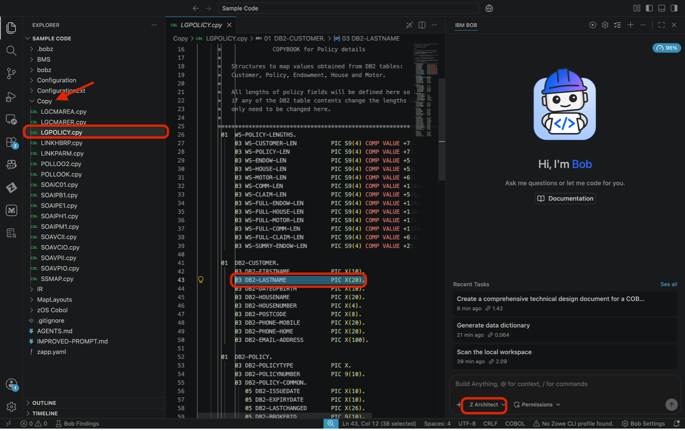

2. **Add Field to Context**
   - Highlight the field definition line
   - Right-click and select **IBM BOB → Add to Context**
   - Verify the field appears in the chat context window
   - You should see something like:

   ```
   LGPOLICY.cpy:43
   ```

> **Tip** Please ensure you only highlight‘03 DB2-FIRSTNAME PIC X(10).’. Don’t include any spaces before or after.

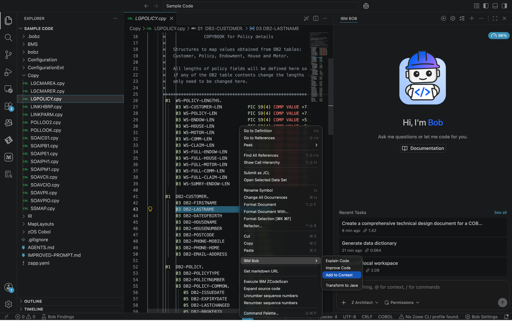

4. **Use / Commands**
   - Bob is loaded with / commands that allow you to leverage prebuilt prompts. In this case, you will use the `/impact-analysis` command to generate a comprehensive impact analysis report for the field you added to context. In the chat, type: - Add to your context:

     `LGPOLICY.cpy:43 /impact-analysis What would be the impact of changing this field to 10?`

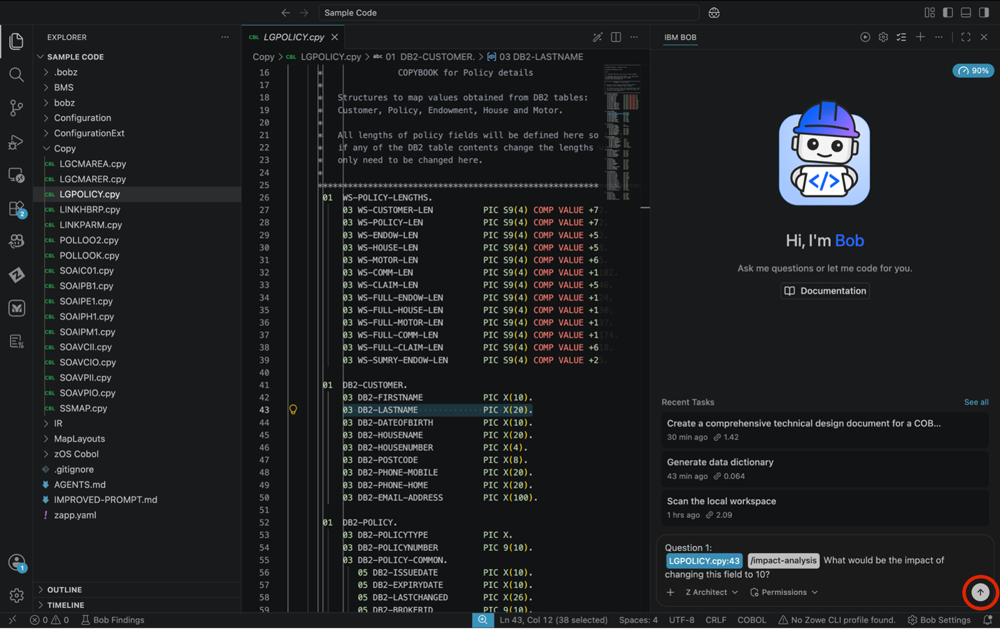

5. **Approve the Request**
   - If auto-approvals are off, click **Approve** for each step or turn some/all approvals on.

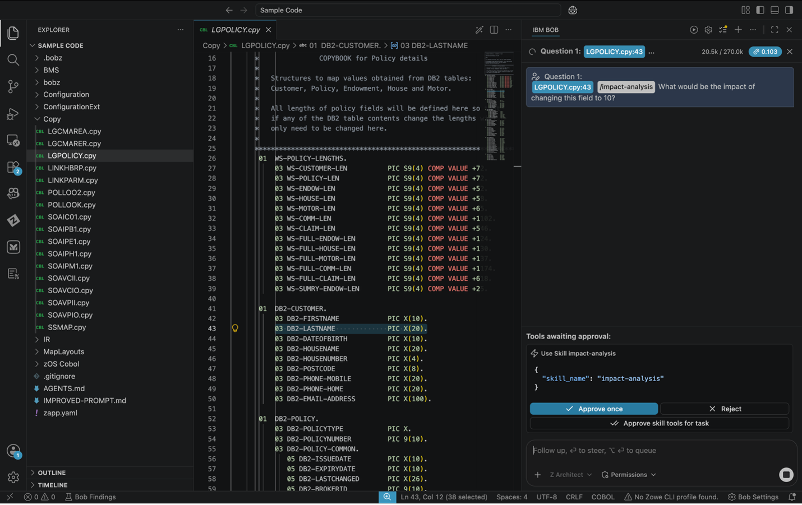

5. **Bob asks for Clarification**
   - Bob will begin the flow of reviewing data and then prompt you with a question to determine what type of impact analysis you want. For the purposes of this lab select the last one:

   ```
   DB2 column is already VARCHAR(10) or smaller – no schema change needed. The copybook just needs to align to it.
   ```

> **Tip** If you do not see this option, select one similar-or you can type a response too instead of selecting an option if ever needed.

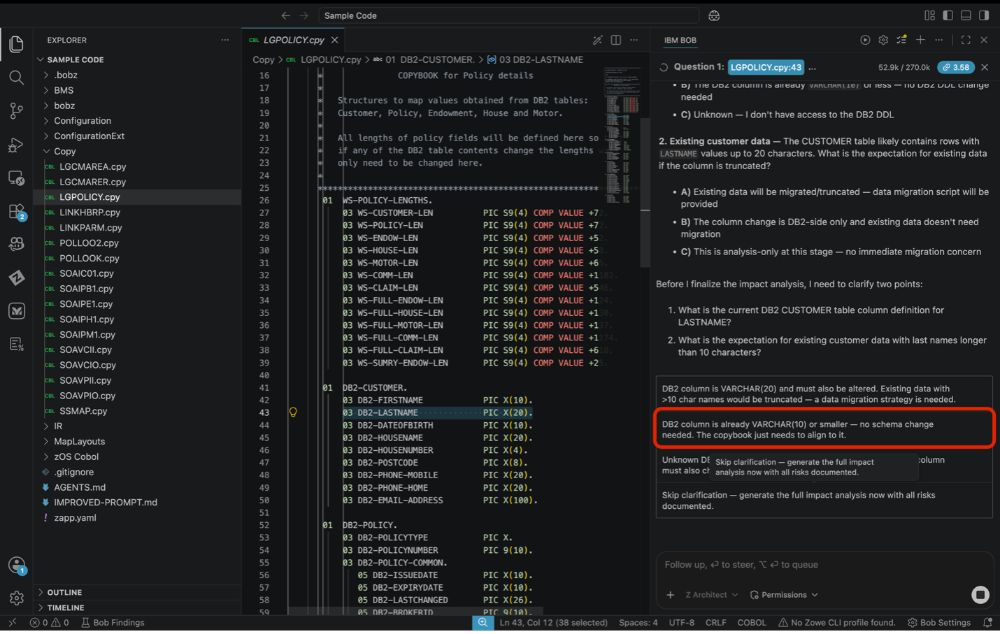

6. **Bob Generates the Impact Analysis**
   - As BOB finishes its analysis, you will see an Impact-Analysis.md file being generated in real time. Please select save or approve.

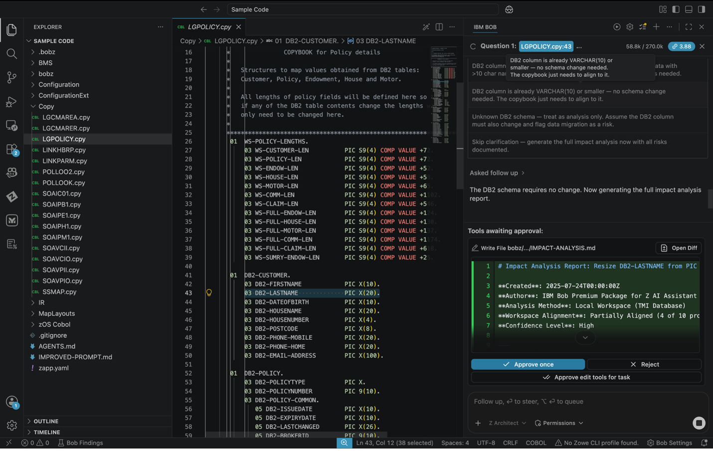

7. **Preview the Impact Analysis**
   - Once the analysis is complete, you can right-click the Impact-Analysis.md file in the file explorer and select **Preview** to view the generated markdown document.

> **Tip** Within the chat window the location of where the report was saved to may vary. For instance in the following example it was generated in bobz/impact-analysis/IMPACT-ANALYSIS.md

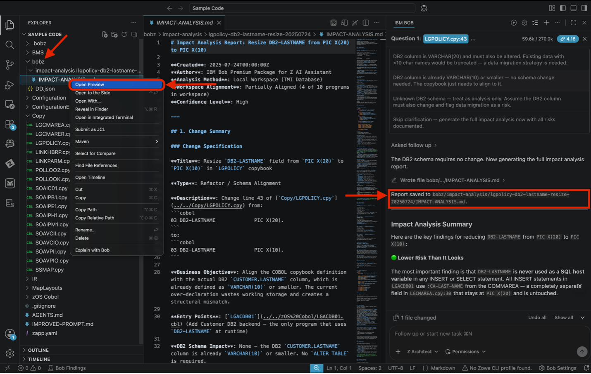

#### Expected Results of Exercise

Once the **Impact-Analysis.md** preview is open, take time to carefully review the full report before proceeding to implementation. The document is structured to show you exactly what is at risk when the field size is reduced from 20 to 10 characters.
Pay particular attention to the following sections within the report:

- **Scope:** the total number of programs and copybooks affected by the change
- **Risk Level:** Bob's assessment of how significant the change is (ex: High, Medium, Low)
- **Affected Components:** a list of every programs that references DB2-LASTNAME either directly or via the LGPOLICY copybook
- **Recommended Implementation Sequence:** the suggested order in which files should be updated to minimize the chance of breaking dependencies during the change

Keep this document open or note the affected file paths, as you will reference them in the next step when implementing the change.

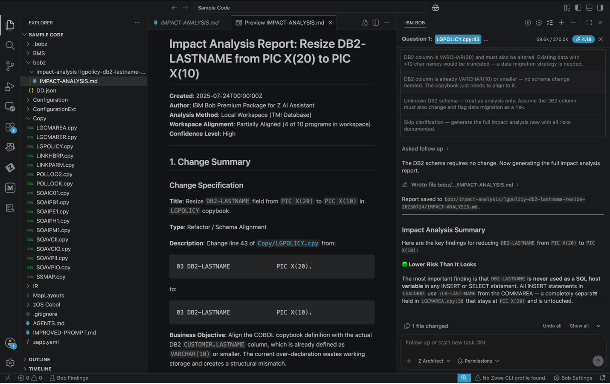

### Exercise: Implement the Change

Take the Impact-Analysis.md report Bob generated and use it to drive real code changes — having Bob apply every edit across all affected programs and produce a DB2 migration script, all from a single prompt.

1. **Switch to Z Code Mode**

   Click the mode selector and switch from **Z Architect** to **Z Code** mode. Z Code mode is optimized for making and reviewing direct code changes.

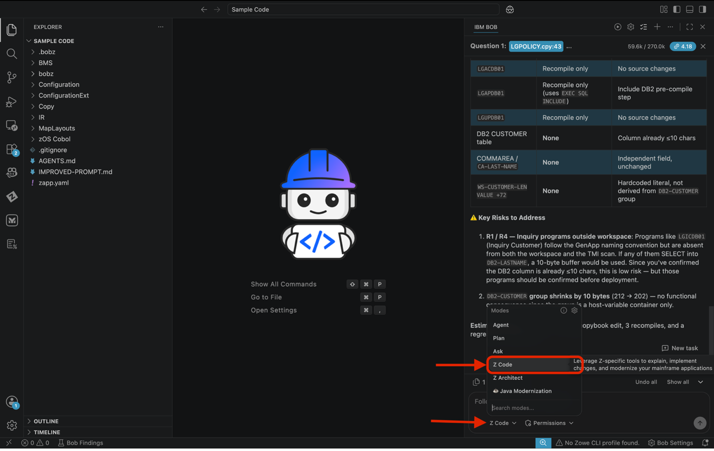

2. **Reference the Impact Report**

   In the chat, enter the following prompt — replacing `<path to file>` with the actual file path of the `Impact-Analysis.md` generated in the previous exercise. You can copy the path by right-clicking the file in the file explorer and selecting **Copy Path**:

   ```
   Use the <path to file> file to implement the change
   ```

> **Tip:** You can also type `@` in the chat bar and select the file directly from the explorer — this inserts the correct path without copying it manually.

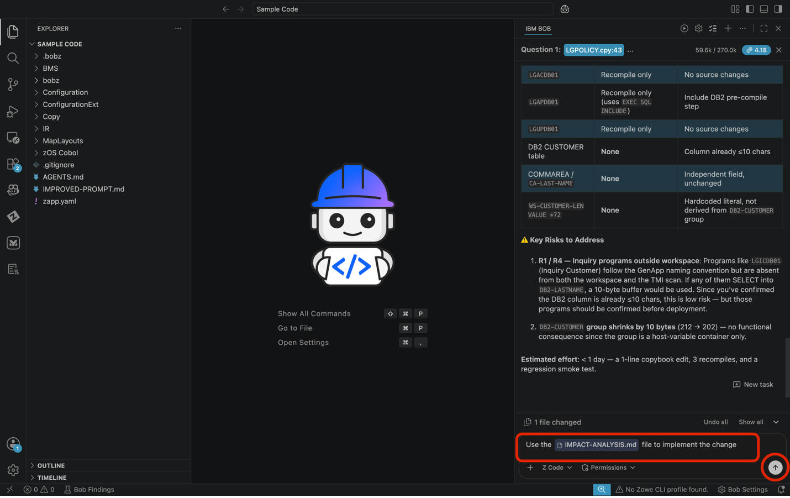

3. **Approve Each Change**

   If Auto Approve is off, you will be prompted to approve each individual change as Bob works through the affected files. Click **Approve** for each request.

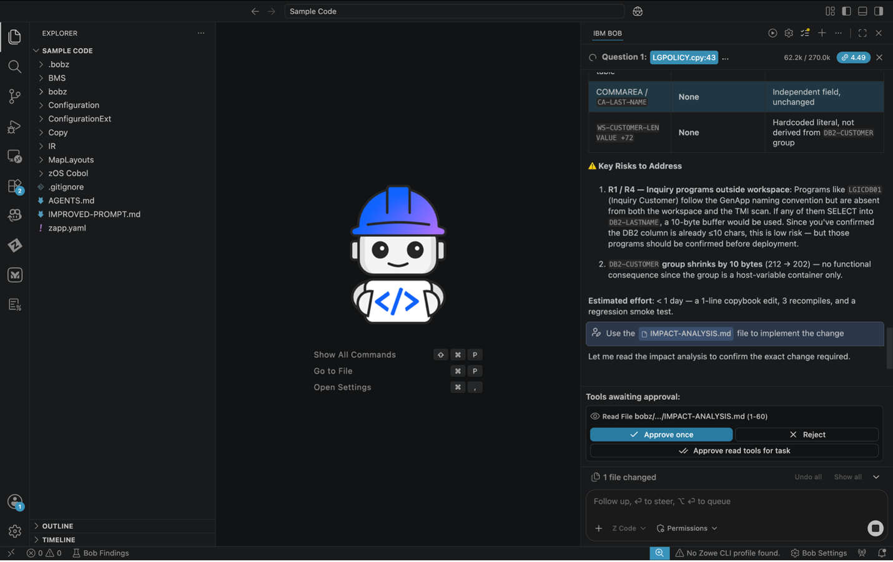

As Bob applies each change, you will see a diff view of the code in the chat window. This allows you to review every change before it is applied to the codebase. You can also click on the file name in the diff view to open the file in the editor and see the changes in context.

- **Green lines** — additions or new content
- **Red lines** — removals or replaced content

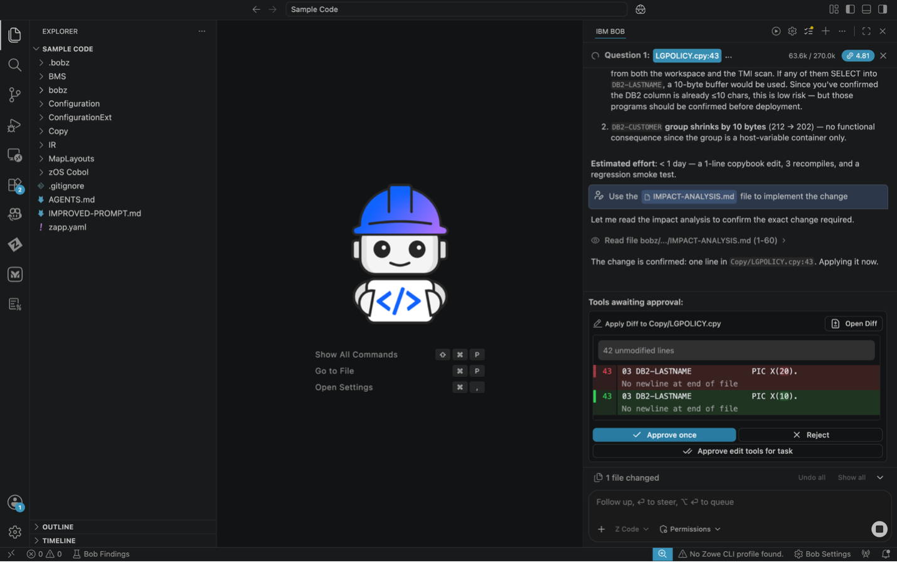

#### Expected Results of Exercise

Once all changes have been applied, BOB will generate database migration scripts. Within the chat you will see a summary of the changes made. Please review to see what changes were made.

- ✅ All affected COBOL programs updated
- ✅ Copybook field definition changed
- ✅ Validation logic updated in affected programs
- ✅ DB2 migration scripts generated
- ✅ Summary of all changes produced

> **Tip** After Bob completes the task you can select **files changed** and select a code file to see the changes made too.

---

## Key Takeaways

- How to select fields for impact analysis
- Generating comprehensive impact reports
- Understanding change propagation
- Identifying all affected components
- Creating safe implementation plans
- Using the impact report to drive actual code changes with Bob
