# Use Case: Z Refactoring & Service Extraction

> **Prerequisites:** Complete `00-lab-setup.md` before starting this use case.
> **Code Set:** Any COBOL workspace — recommended code: `Sample Code`
> **Duration:** 60 minutes
> **Difficulty:** Intermediate

---

## Overview

In this use case, you'll identify business rules in monolithic COBOL programs, check dependencies, and extract business services for modernization — transforming legacy mainframe applications toward service-oriented architectures.

---

## Learning Objectives

By the end of this use case, you will be able to:

- Identify business rules functionality in monolithic COBOL programs
- Check dependencies before refactoring code
- Extract business services from COBOL programs
- Create REST API wrappers for extracted services
- Integrate refactored services with main programs
- Understand service-oriented architecture patterns for mainframe modernization

---

## Exercise: Identify Business Rules Functionality

Learn to identify which parts of a COBOL program contain pure business logic that can be extracted into services, versus infrastructure code that should remain in the main program.

### Actions

> Ensure you are in **Z Code** mode

1. **Analyze for Refactor Candidates**
   - Enter the following prompt into the chat window:

   ```
   Analyze LGDPDB01, LGAPDB01, LGACDB01, and LGUPDB01. Identify all policy validation business rules including policy number format checks policy type validation, and customer-policy relationship verification. Map all programs that perform policy validation. Check which programs call these validators and which DB2 tables are accessed. Identify shared copybooks.
   ```

   - Click **arrow up** to start the analysis.

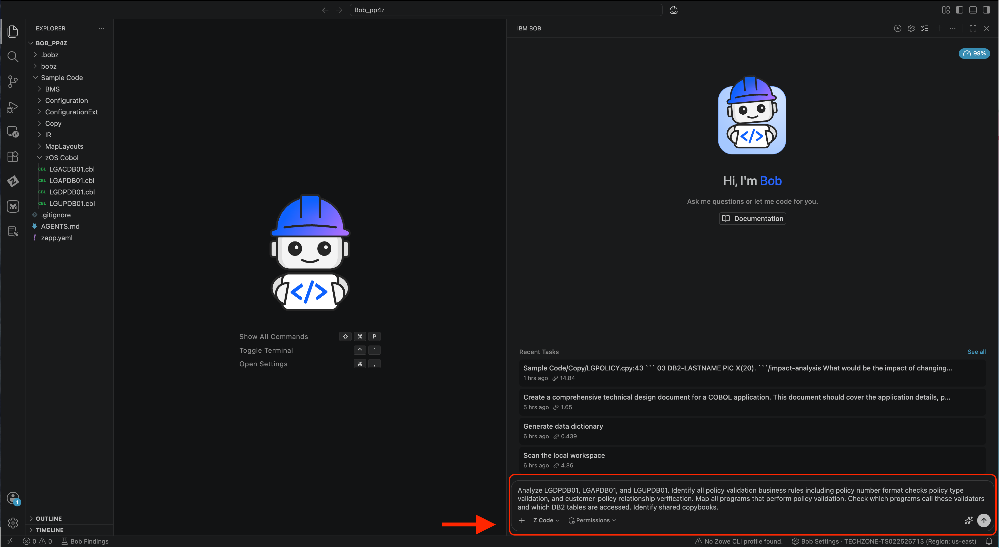

2. **Review the Analysis Results**
   Bob will analyze multiple COBOL programs and automatically generating a structured task list. The tool will identify key business rule areas such as policy validation, customer relationships, and data integrity checks. Users can review the generated tasks and approve them to proceed with deeper analysis, ensuring alignment before execution.
   -Please continue to approve any requests for skills or various requests unless otherwise noted.

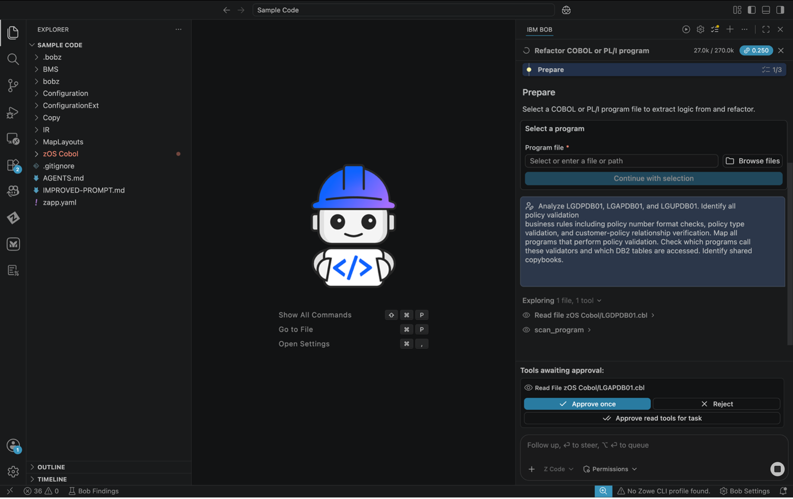

### Expected Results

This example shows Bob completing the analysis and generating structured business rule documentation. Based on multiple COBOL programs, it consolidates findings into a clear, organized output, highlighting validation logic, data formats, and program relationships. This allows users to quickly understand core business rules and supports downstream tasks like modernization and impact analysis. You may review through a generated markdown or within the chat window on the right.

## Exercise: Refactor Business Services

Before refactoring, it's critical to understand what dependencies exist. This prevents breaking changes and helps plan the extraction strategy.

### Actions

1. Take the following prompt and paste it into the chat window:
   ```
   Create LGPOLVAL service that consolidates policy validation rules. Extract validation logic from LGDPDB01, LGAPDB01, LGACDB01, and LGUPDB01 into the new service.
   ```

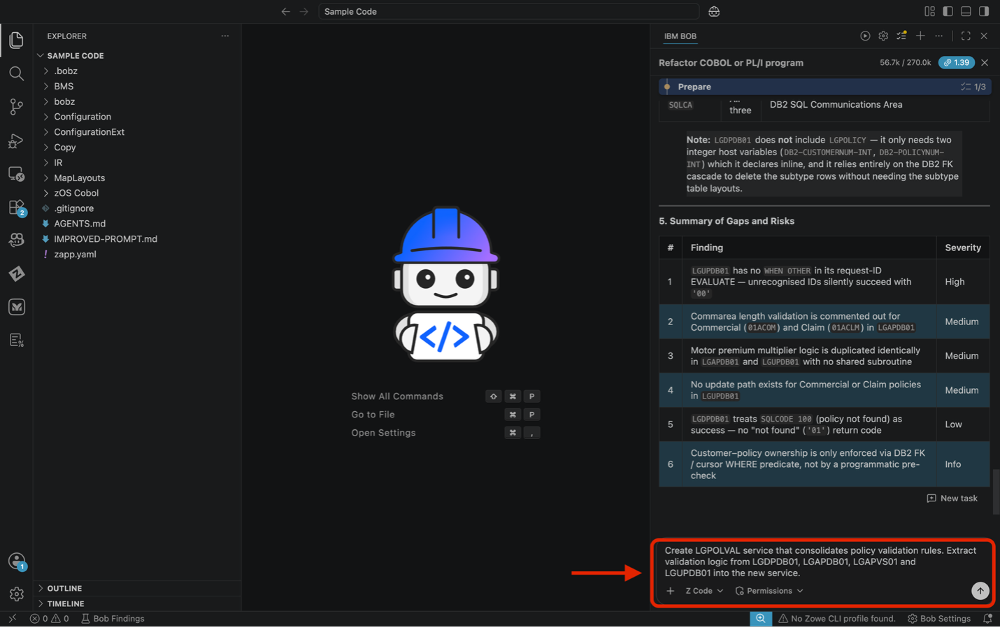

2. You will be prompted to approve the request. Please click **Approve** to continue, or you can select **Auto Approve** to approve all requests automatically.

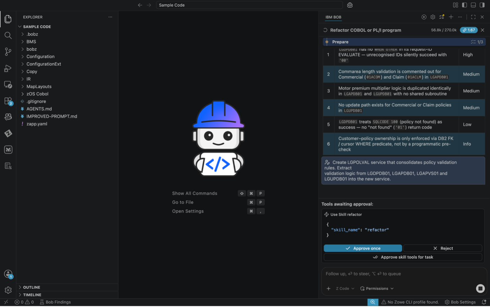

3. If prompted please select “Continue – Read application copybooks listed above”.

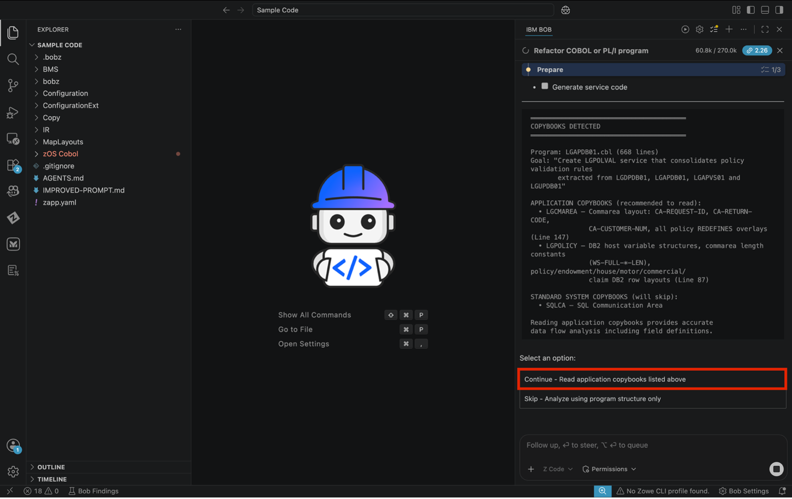

4. The generation of the program will begin. Please wait for this to complete.

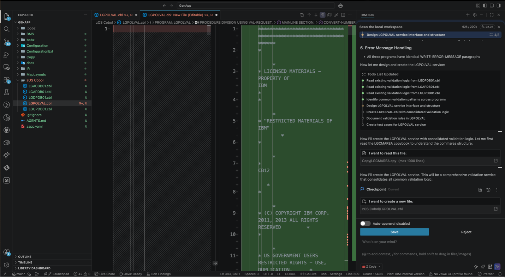

5. Select the “1 – Mainline validation block – cross- program (recommended). If prompted please also select the “Generate – Create LGPOLVAL.cbl”

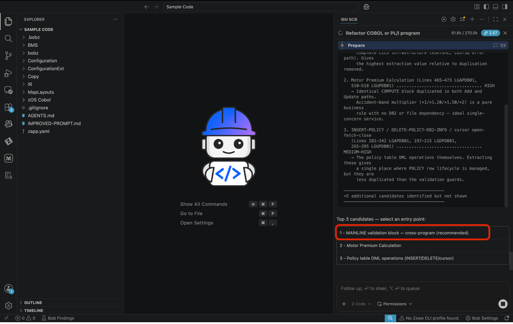

6. Please select the approve option during generation

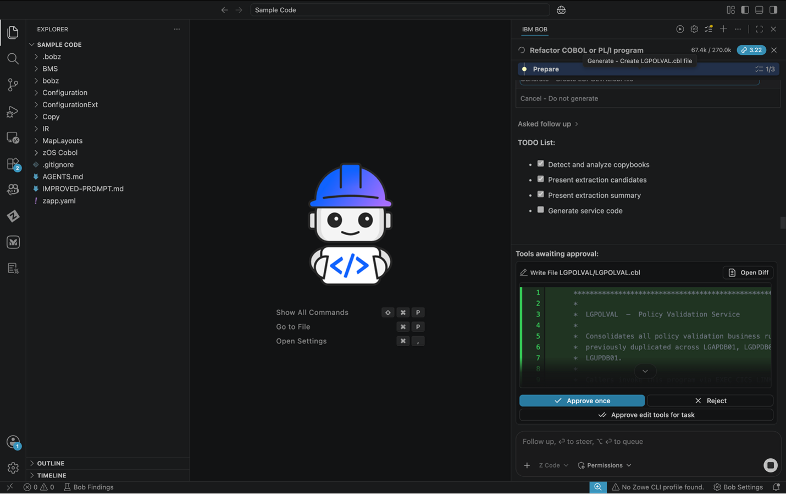

7. Please read through the generated information in the chat window. Locate the generated code for review.

Example: `C:/Users/<YourUserName>/Documents/Bob/Sample Code/zOS Cobol/LGPOLVAL.cbl`

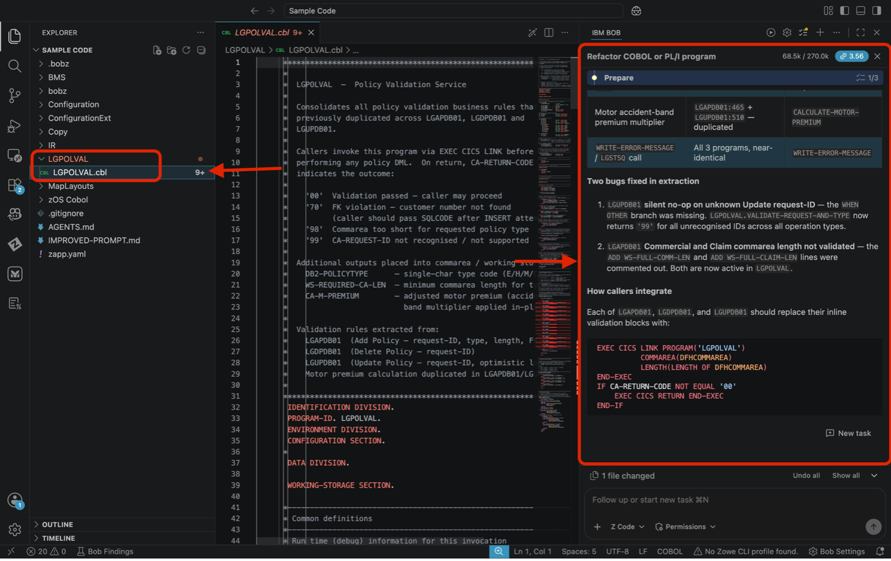

### Expected Results

- ✅ Business rules identified and documented
- ✅ Dependencies checked and mapped
- ✅ COBOL service program generated with extracted business logic

## Exercise: Add Link Code to Main Module

### Actions

1. Please paste the following prompt on the chat window on the right as shown in the image below.

   ```
   Update LGDPDB01, LGAPDB01, and LGUPDB01 to call LGPOLVAL service. Replace inline validation with CICS LINK calls. Add proper error handling for service failures.
   ```

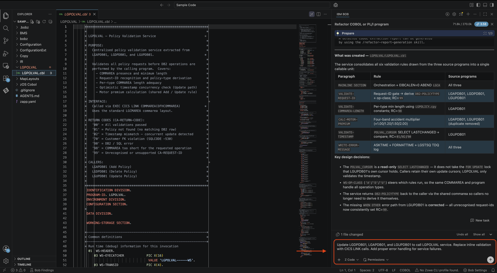

2. When prompted please continue to select approve unless otherwise noted.

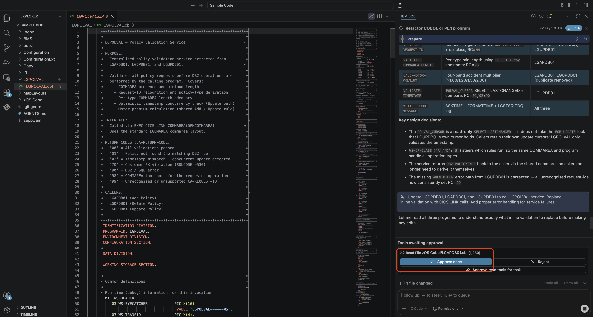

3. You’ll be able to see the exact changes while the to do list completes. Please continue to select the approve option while Bob works through the To Do List.

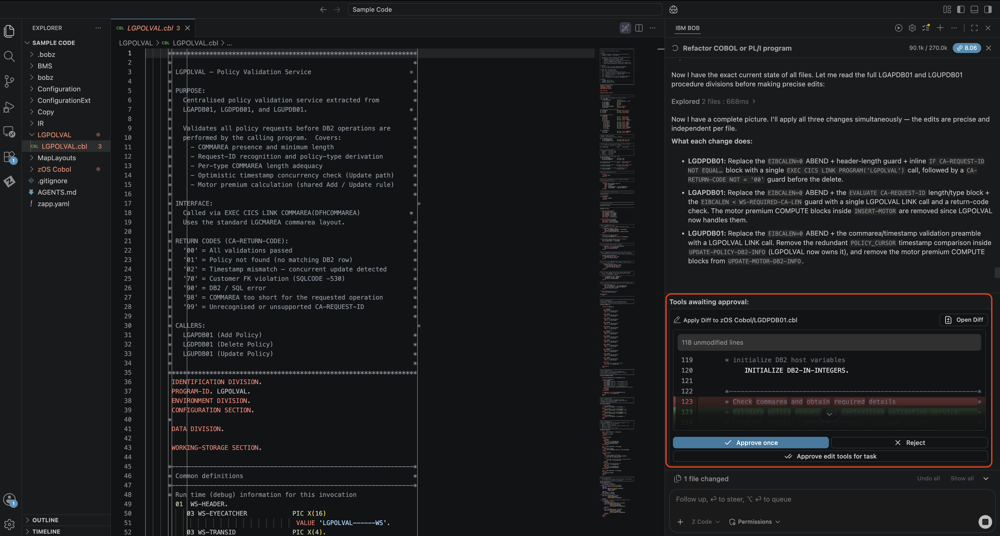

4. Please review the completed changes!

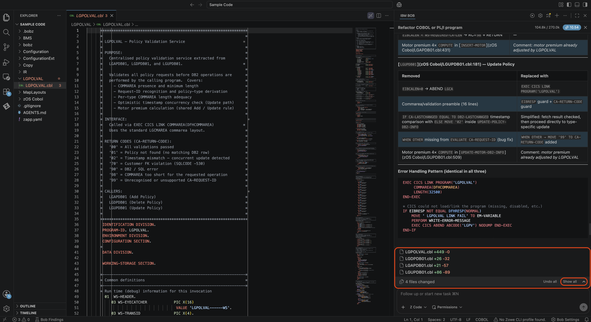

### Expected Results

- ✅ Main programs updated to call service
- ✅ Original business logic removed
- ✅ Parameter passing implemented correctly
- ✅ Error handling maintained

---

## Key Takeaways

- How to identify extractable business rules in COBOL
- Checking dependencies before refactoring
- Extracting business services from monolithic code
- Creating REST API wrappers for COBOL services
- Integrating refactored services with main programs
- Service-oriented architecture patterns for mainframes
