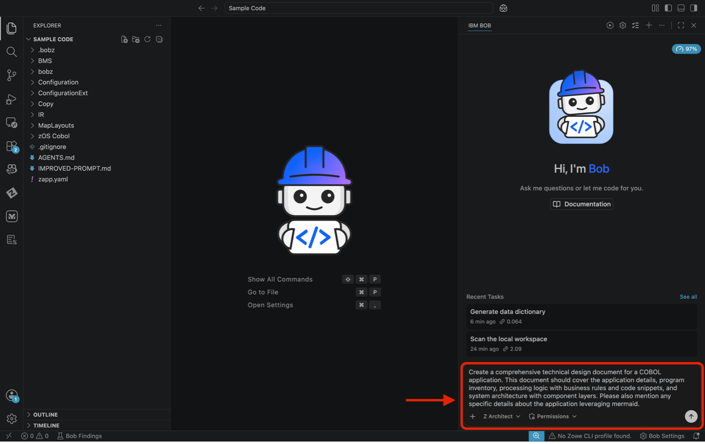
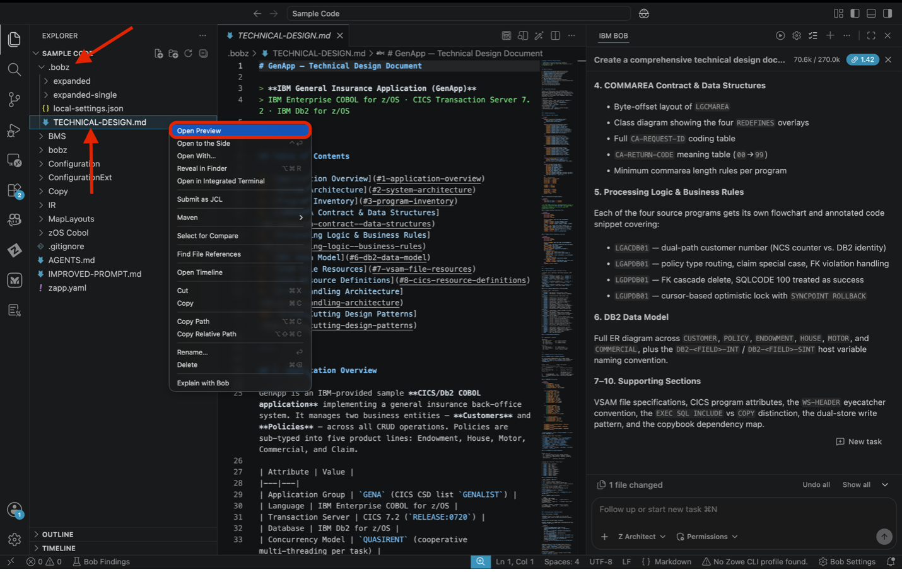
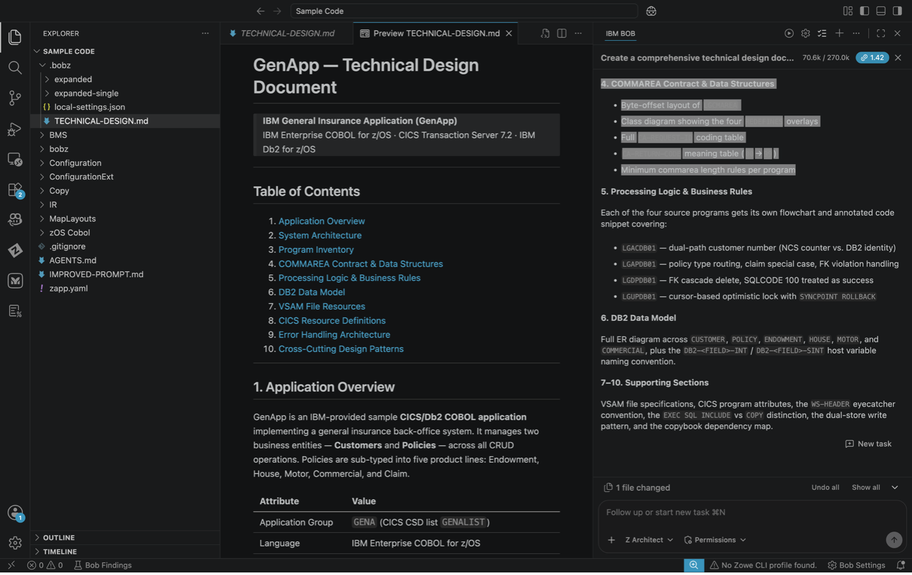

# Use Case: Technical Design Document

> **Prerequisites:** Complete `00-lab-setup.md` before starting this use case
> **Code Set:** Any COBOL workspace — recommended code: `Sample Code`
> **Duration:** 10–15 minutes
> **Difficulty:** Beginner

---

## Overview

Generate a comprehensive technical design document for your COBOL application — covering program inventory, processing logic with business rules, code snippets, and system architecture with visual Mermaid diagrams. The document is produced from the metadata built during lab setup.

---

## Learning Objectives

- Generate a complete technical design document from an existing COBOL codebase
- Understand how Bob extracts business rules and explains them in plain language
- Produce architecture diagrams automatically from code analysis
- Create a document suitable for technical and non-technical stakeholders

---

## Actions:

1. Ensure you are in **Z Architect** mode and in the chat, paste the following prompt:

```
Create a comprehensive technical design document for a COBOL application. This document should cover the application details, program inventory, processing logic with business rules and code snippets, and system architecture with component layers. Please also mention any specific details about the application leveraging mermaid.
```



3. If auto-approvals are off, click **Approve** for each step or turn some/all aprovals on.

> **Tip**During generation, you may see that BOB creates a to-do list where it will create an action plan of what it’s going to do.

4. Generation typically takes 3–5 minutes. **Please note**, the name of your document may not be the exact same and may take a few minutes to complete. This document is fully editable, so you can make any changes in the chat at any time. When complete, use the **Preview** option to view the generated markdown document.

> **Tip** The generated file will be located in .bobz/<File Name></file>. In the following example the document is named Technical-Design.md, your file may have a different name.



### Expected Results

- ✅ Comprehensive technical design document created
- ✅ All programs listed with descriptions
- ✅ Business rules extracted and explained in plain English
- ✅ Architecture diagrams generated (Mermaid)
- ✅ Code snippets included for key logic
- ✅ Component relationships visualized



---

## Key Takeaways

- **Literate Coding:** Bob explains COBOL in natural language — accessible to non-technical stakeholders
- **Visual Documentation:** Mermaid diagrams generated automatically from code analysis
- **Multi-Mode Intelligence:** Z Architect mode specializes in analysis and documentation tasks

---
