# Use Case: Z UI Modernization — CICS to Modern Web

> **Prerequisites:** Complete `building-labs/00-lab-setup.md` before starting this use case.
> **Code Set:** Any COBOL workspace — recommended code: `Sample Code`
> **Duration:** 45 minutes
> **Difficulty:** Intermediate

---

## Overview

In this use case, you'll transform CICS green screen applications into modern web interfaces — analyzing BMS maps, understanding screen flow, and generating modern UI components with REST APIs.

---

## Exercise: Understand & Analyze Insurance Application

Learn to analyze CICS screens and understand the business flow, data requirements, and user interactions.

### Actions

1. Ensure you are in **Z Architect** mode, and copy and paste the following into the chat:

```
   Create an analysis document of this application that helps analyze the conversion of greenscreens to a modern UI
   1. Identify all screens and their purposes
   2. Map screen fields to data entities
   3. Identify user workflows and navigation patterns
   4. Determine which screens should become:
      - Separate pages
      - Modal dialogs
      - Inline forms
      - Dashboard widgets
   5. Identify data relationships between screens
   6. Suggest modern UI/UX improvements
   Provide a comprehensive analysis with:
   - Screen inventory and categorization
   - Data model mapping
   - User journey flows
   - Recommended modern UI patterns
```

> **Tip** When you paste it may show as “Pasted Text”, if you click on it, it will appear like before. Please press enter once completed.

> **Recommendation** Turn Auto approve on during this section!

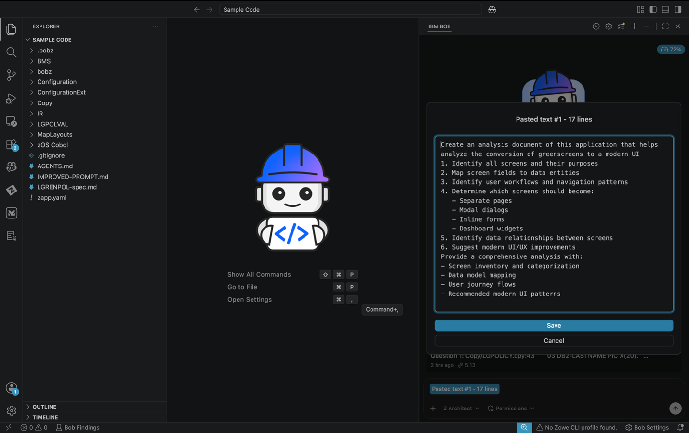

2. In the chat box, you’ll notice BOB will begin to generate information, such as reading from the various files to understand the ask. Please continue to select approve, including the generation of the analysis file.

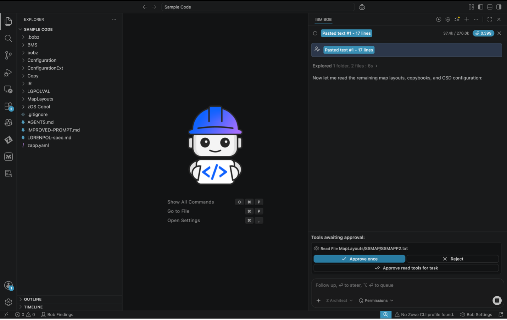

3. In the chat box, review the generated content to find the location where the documents have been generated. Please open this as a preview.

Example:
For example, this document is located in .bobz/greenscreen-modernization-analysis.md.

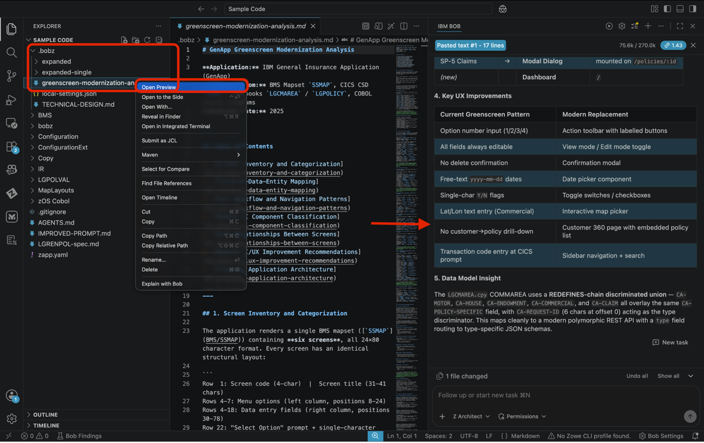

4. Please scroll down the generated output to find information such as modern UX/UI Recommendations, Rest API Endpoints etc.

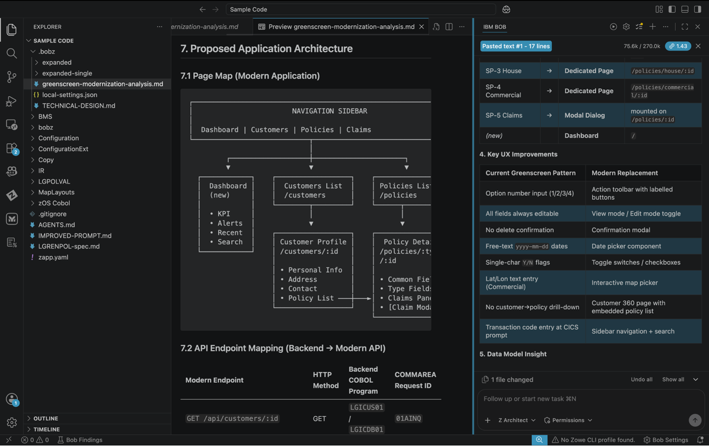

### Expected Results

- ✅ Complete screen inventory documented
- ✅ Screen flow understood
- ✅ Data fields cataloged
- ✅ Validation rules identified
- ✅ Navigation paths mapped

## Exercise 2: Leverage prompt within chat to implement UI

Transform green screen specifications into modern, user-friendly web interface designs.

### Actions

1. Please switch to Z Code Mode and copy the path from the Improved_Prompt.md to paste into the chat session.
   In the chat window, enter the following prompt, replacing <path to file></path> with the actual file path of the Improved_Prompt.md file. You can copy the path by right clicking the file in the explorer panel and selecting Copy Path:

```
Use the <path to file> file to implement.
```

> **Tip**: You can also use the @ symbol in the chat bar to reference files directly from the explorer, which automatically inserts the correct path without needing to copy it manually.

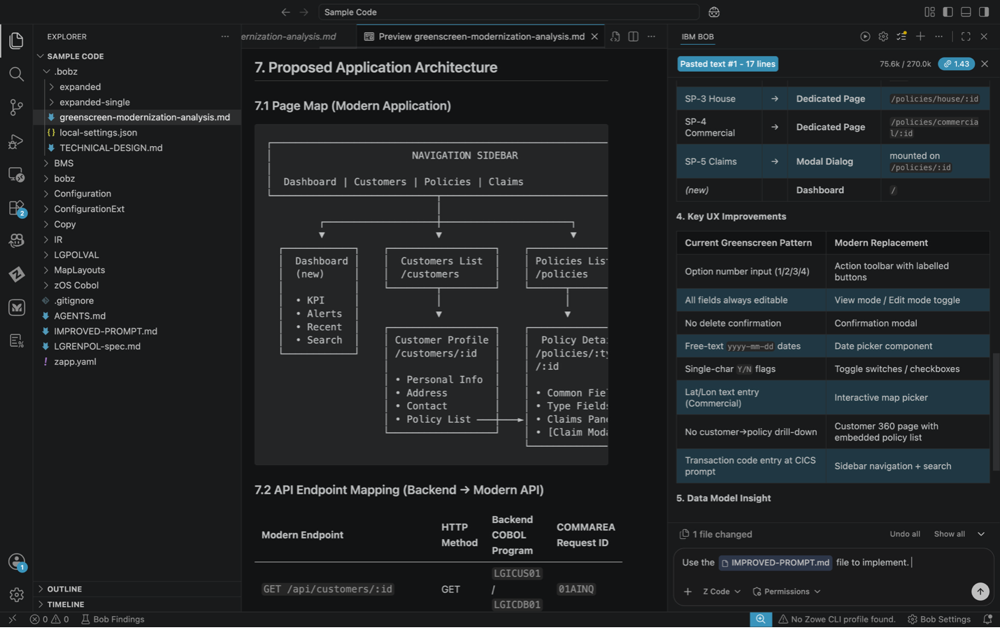

2. You’ll notice that BOB creates an action plan as it moves through the creation of these features. You will be asked to approve some actions if auto approve is turned off. Recommendation is to turn it on for this portion.

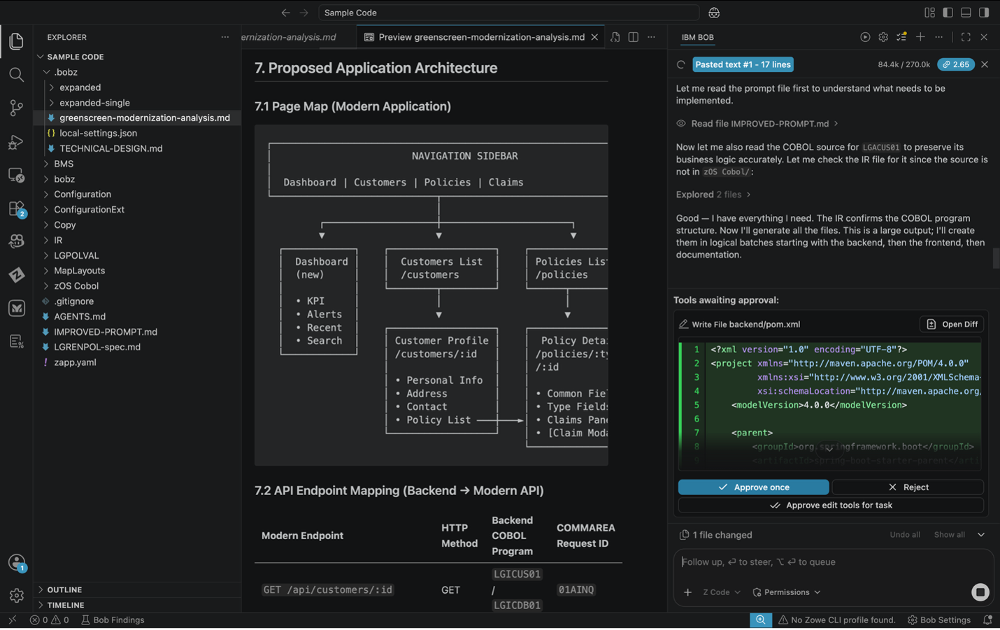

3. During generation you will notice that multiple files have been generated. The modernization code for the front-end and the back-end will get generated first, afterwards you will see a quick start guide gets generated as the one of the last steps of running the long prompt. Please open the Quickstart.md as a preview.

> Sometimes it doesn’t complete and you don’t have your QUICKSTART.md - in that case you will need to do an additional prompt to get it finished.(Please finish your work on this till you have the QUICKSTART.md file generated)

4. You will see some commands to start the services in the final outputs of the chat. These commands may be slightly different from the screenshots below. If you receive an error message in starting a service, please flag an instructor down.

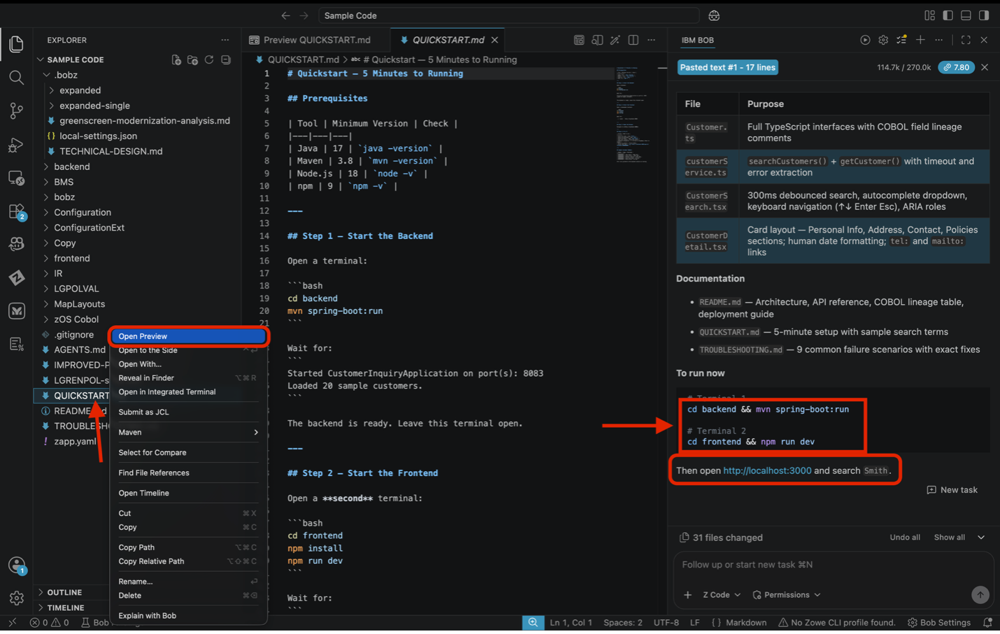

5. Bring up the terminal in VS Code

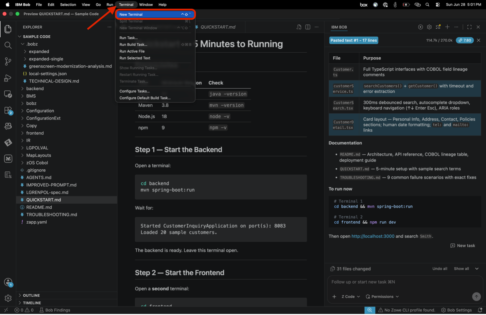

> **STOP** Take a moment and ensure you have all the necessary items installed, if you do not - see your QUICKSTART.md for links to install in your system.

6. Issue the following commands that are in your QUICKSTART.md to get to the backend and then run command. These may be different than what you see below. If you have any trouble please alert an instructor!
   For example, the commands may look like this:

```
cd <path to backend>
mvn spring-boot:run
```

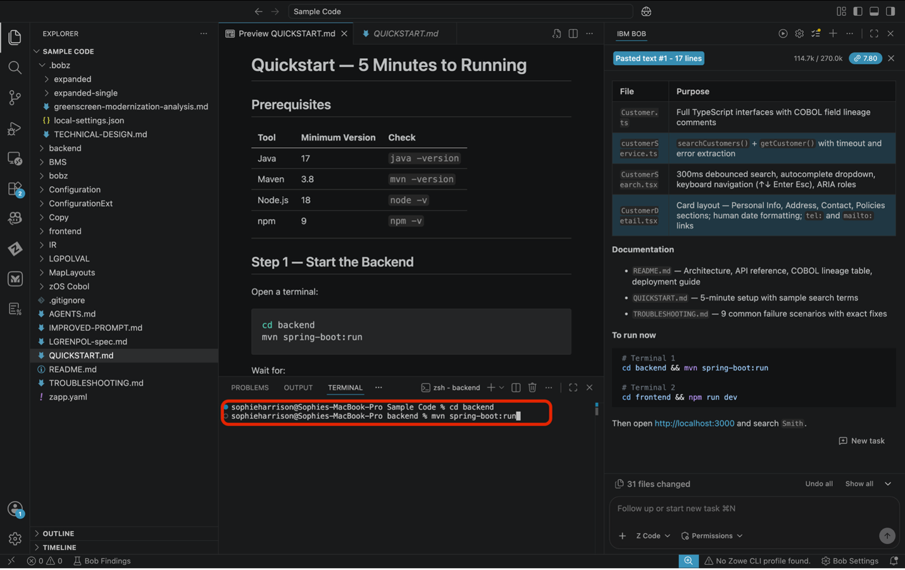

7. You should see where it mentions having loaded 20 sample customers. Leave this terminal running.

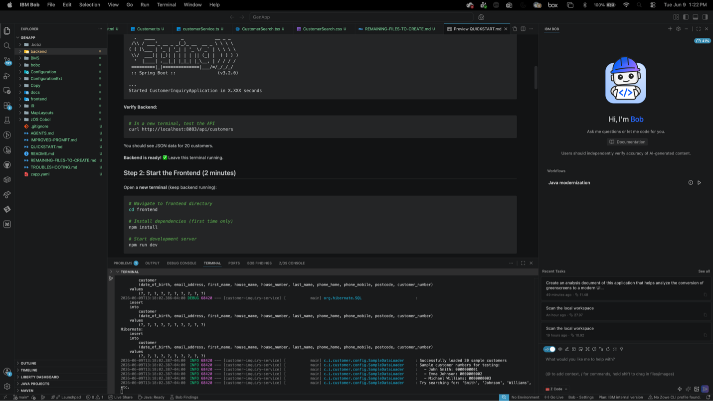

8. Open a second terminal

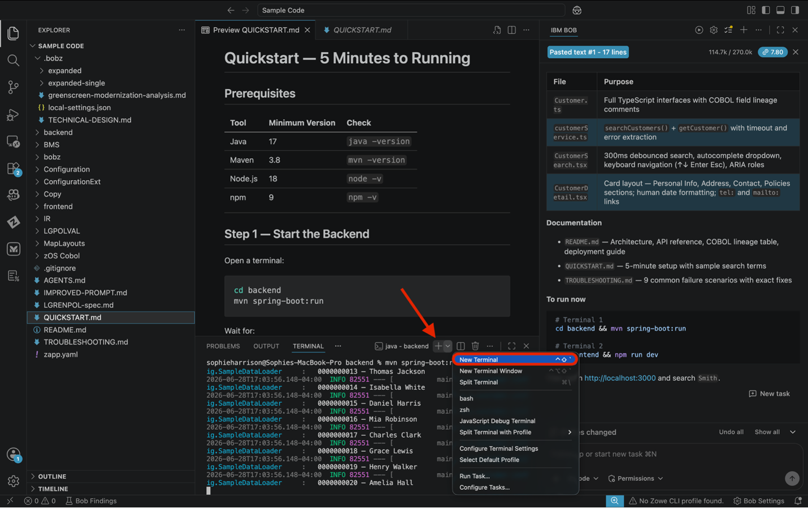

9. Issue the following commands:

```
Cd <path to frontend>
Npm install && npm run dev
```

> **Note** In the following example picture npm install is not issued as it has been previously installed.

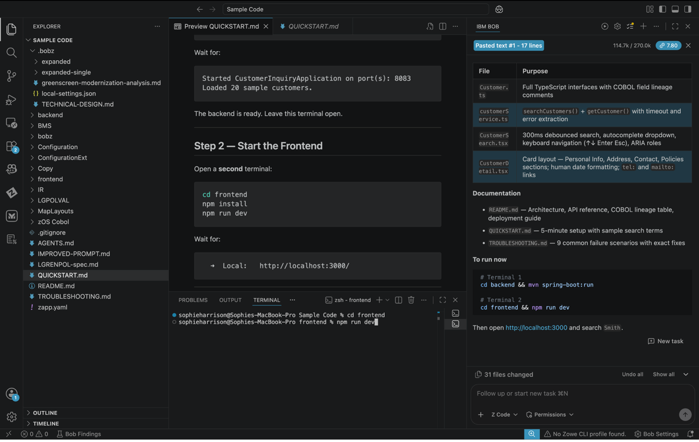

10. Click “follow link” on the local address listed.

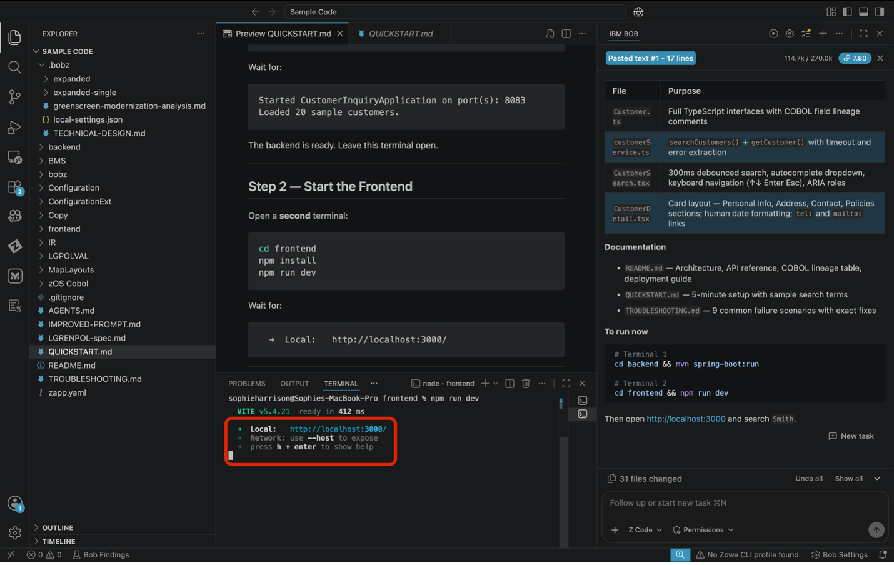

11. Explore UI

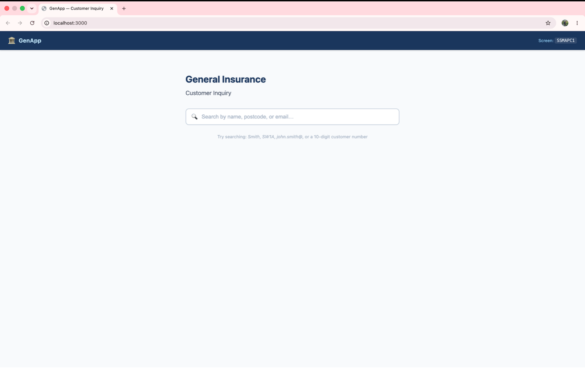

12. Try typing Smith into the search bar, here we can see that personal information has been added into customer details.

> **Tip** If your UI doesn’t look like the one in the picture you can grab a screenshot and prompt Bob in code mode to make your frontend to look like the picture attached and add the picture and he will match it.

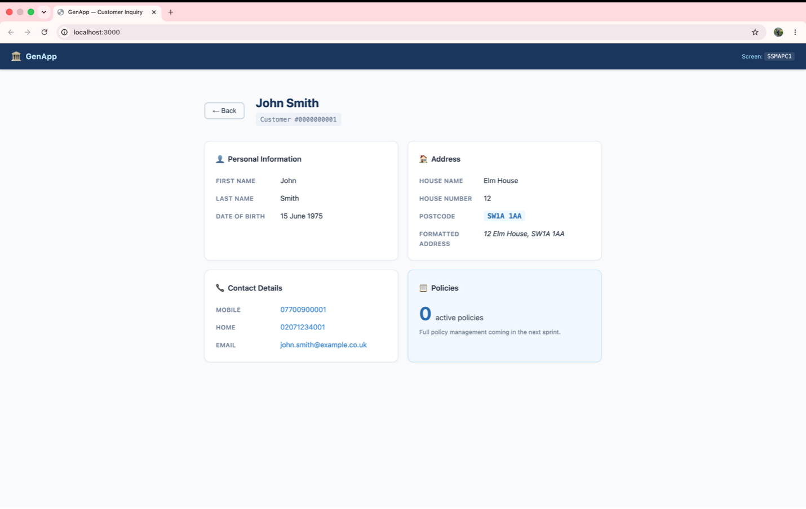

### Expected Results

- ✅ Modern UI design created
- ✅ Component structure defined
- ✅ React/Angular code generated
- ✅ Responsive layout implemented
- ✅ Form validation included
- ✅ Error handling comprehensive
