## Lab 1: Getting Started with IBM Bob Premium for Z

This lab introduces Bob, walks through the interface, and completes the three setup steps that every use case depends on.

---

### Part 1: What Is IBM Bob Premium for Z?

**IBM Bob** is an AI-powered coding assistant built into VS Code. Bob Premium for Z is the edition purpose-built for mainframe development — it understands COBOL, PL/I, HLASM, JCL, CICS, IMS, MQ, and DB2 natively.

#### Bob Is a Multi-Agent System

Bob is not a single AI model answering questions. It is a **multi-agent system** — a team of specialized AI agents that coordinate to complete tasks.

When you send Bob a prompt, here is what happens behind the scenes:

1. A **planning agent** reads your request and breaks it into a series of steps
2. **Specialist agents** (Z Architect, Z Code, etc.) each handle the parts they are best suited for
3. Agents call **tools** to read your code, query the metadata database, and take actions
4. Each tool call requires your approval (unless you turn on Auto Approve) — this keeps you in control
5. Agents share what they discover and hand off work to each other as the task progresses

This is why Bob produces results that feel like a team of experts worked on your code — because, architecturally, a team did.

#### What Makes Bob Different for Z

| Capability | What It Means for You |
|---|---|
| **Workspace-level understanding** | Bob scans your entire codebase, not just the file you have open. It understands program relationships, copybook dependencies, and DB2 table mappings. |
| **Z-native modes** | Z Architect mode handles analysis, documentation, and planning. Z Code mode handles code changes, generation, and modernization. Each mode uses agents tuned for that type of work. |
| **Persistent context** | Agent.md and the Data Dictionary follow Bob across every session. You set them up once; they guide Bob from that point forward. |
| **Tool-driven actions** | Bob doesn't just describe what to do — it does it. It reads files, edits code, generates documents, and runs analysis queries directly in your workspace. |
| **Approval-based workflow** | Every action Bob wants to take appears as a tool request you must approve. You always see what Bob is about to do before it does it. |

---

### Part 2: The Bob Interface

Before running any prompts, take a moment to orient yourself to the Bob interface inside VS Code.

#### The VS Code Layout with Bob

**Left panel — File Explorer**
This is where your code lives. When Bob generates documentation, architecture diagrams, data dictionaries, or new programs, they appear here as files you can open.

**Right panel — Chat Window**
This is where you interact with Bob. Type prompts, review responses, and approve or decline tool requests. When Bob wants to read a file or run an analysis tool, you'll see a tool request card appear in the chat.

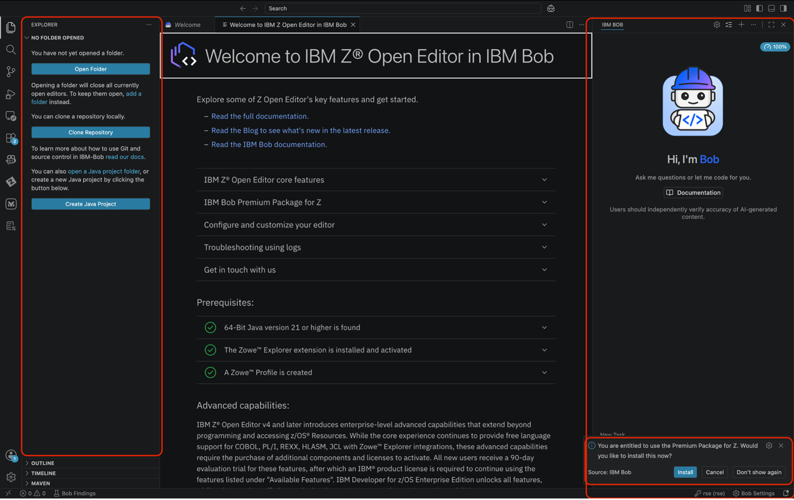

#### Ensure You Have Access to Bob Premium for Z

ACTION: Under bob settings, locate the general settings.

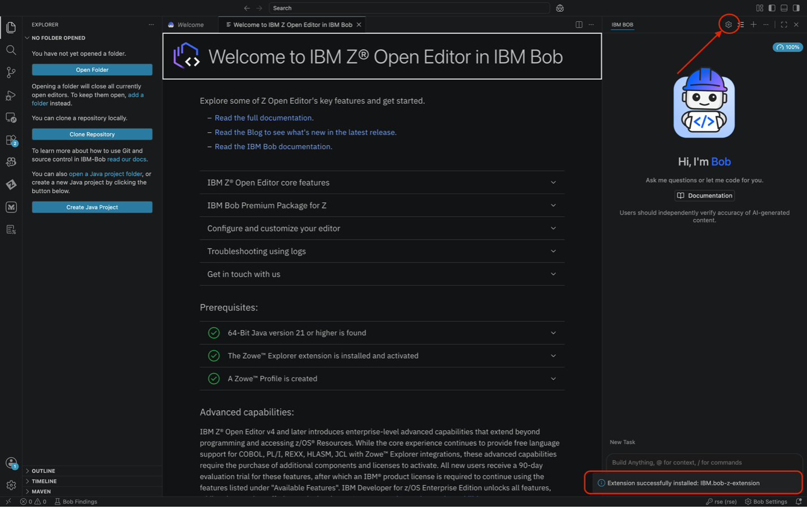

ACTION: Select the team's name from the drop down, for instance, in the screenshot **techzone-bobathon**. Please ask your instructor for the team's name for this bobathon.

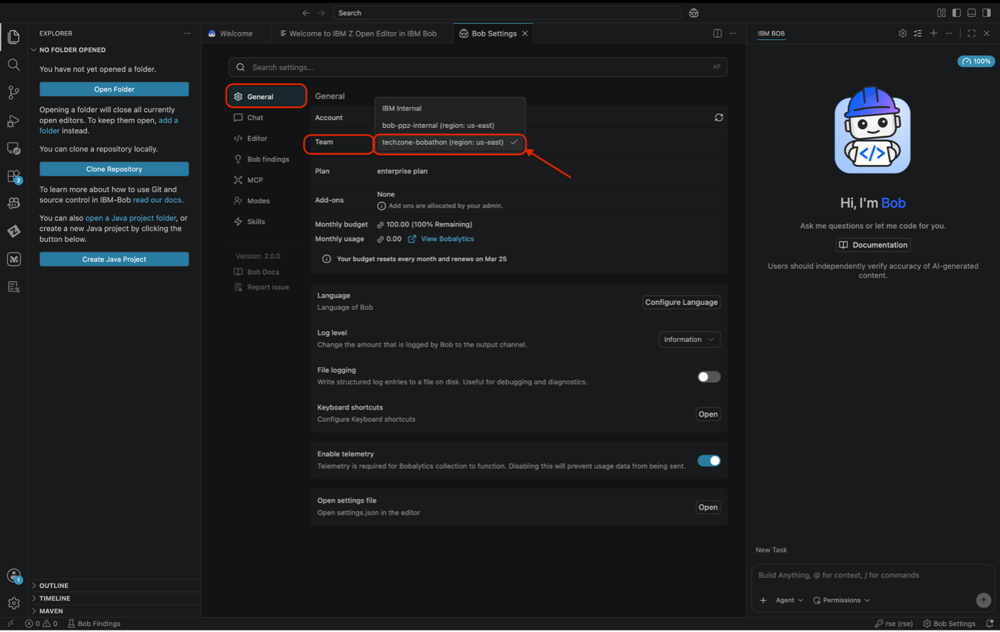

#### Pulling the Sample Application Code to Use with Bob

ACTION: In Bob and in the Explorer section select **Open Folder**.

::: {.callout-tip}
## Tip
You can also use the keyboard shortcut **Ctrl + K, Ctrl + O** to open a folder or select **File → Open Folder** from the menu bar.
:::

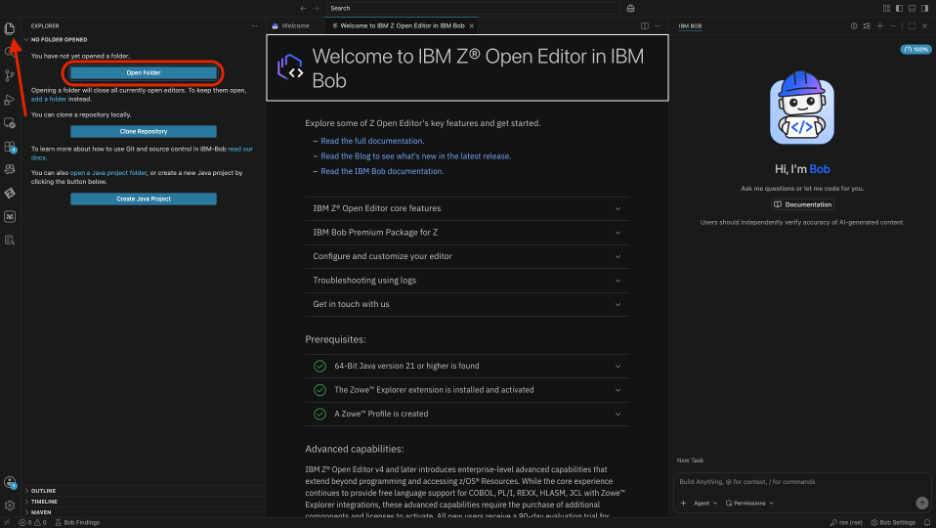

ACTION: Please select the Sample Code Folder you downloaded and click the **Open** button.

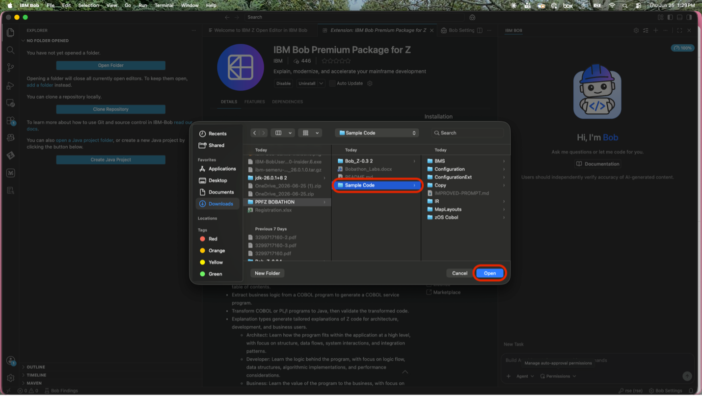

Once complete you should see the sample code in the Explorer section of VS Code.

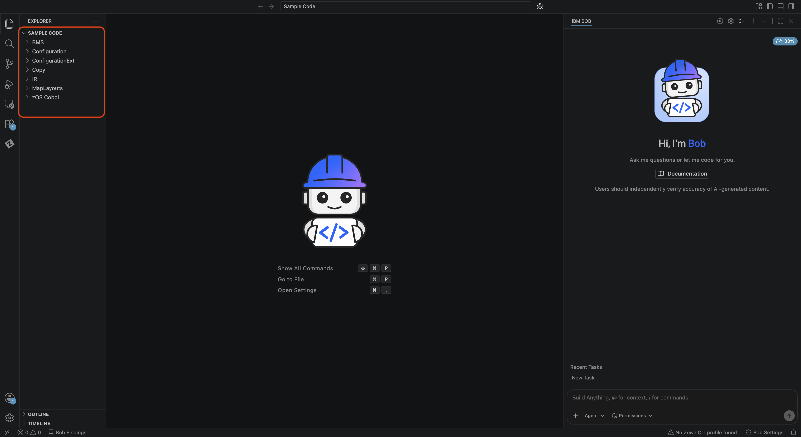

#### Switching Modes

The **mode selector** is at the bottom of the chat window. Click it to see available modes and switch between them.

| Mode | When to Use |
|---|---|
| **Z Architect** | Analysis, documentation, impact analysis, architecture diagrams, data dictionaries, Agent.md setup |
| **Z Code** | Code changes, service extraction, UI modernization, code generation, COBOL-to-Java |

::: {.callout-warning}
## Mode Matters
Bob uses different agents depending on the active mode. If a prompt isn't getting the result you expect, check that you are in the right mode first.
:::

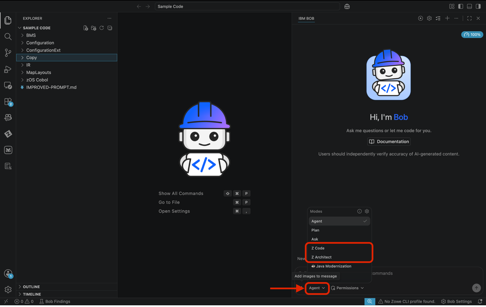

#### Tool Request Approvals

When Bob needs to take an action, a tool request card appears in the chat:

- Click **Approve** to let Bob proceed
- Click **Reject** to stop that specific action
- You can also enable **Auto Approve** (**Permissions** dropdown near the mode selector) to approve all requests automatically — useful for long-running workflows

::: {.callout-tip}
## Tip
You may be asked to approve several requests in sequence for a single prompt. This is normal — each approval allows Bob to complete one step before moving to the next.
:::

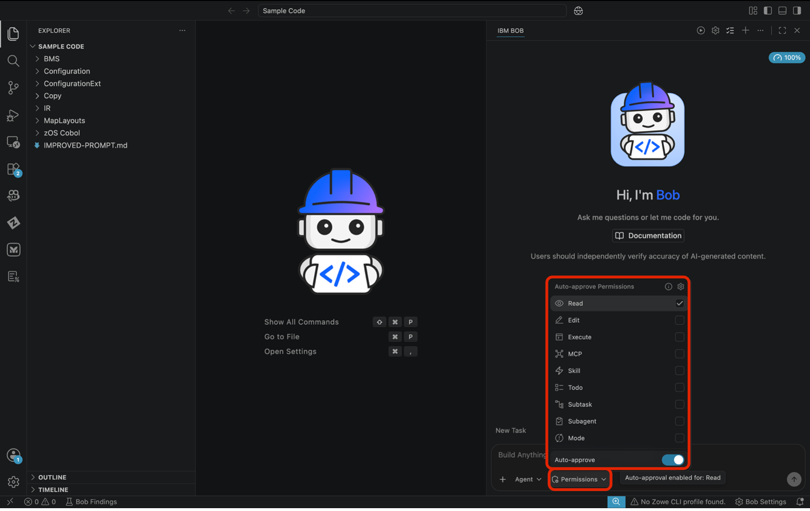

#### Starting a New Chat

Click the **+** button at the top of the chat panel to start a fresh conversation. Your chat history is preserved — you can browse previous sessions using the history icon. A fresh chat is recommended at the start of each new use case to avoid context from a prior session carrying over.

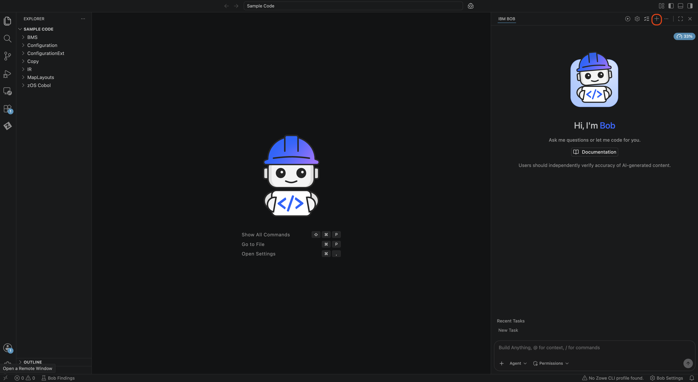

#### Tasks

You can also run multiple tasks at once and here is where you may toggle between them.

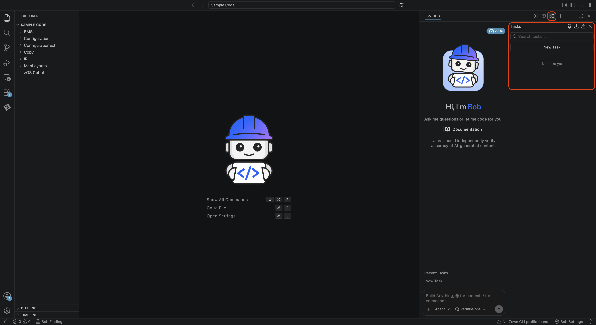

---

### Part 3: Scan the Workspace

#### What This Does

The workspace scan builds a local metadata database that Bob uses to understand your entire application — program inventory, copybook dependencies, DB2 table mappings, call graphs, and program-to-program relationships. This database is what allows Bob to answer questions like "what programs use this field?" or "what does this program call?" without you having to tell it anything.

**Without the scan:** Bob works only from files you explicitly share or mention.

**With the scan:** Bob proactively builds out and has a deep understanding of the whole application.

#### Actions

1. Ensure you are in **Z Architect** mode. In the chat window, please paste/type the following prompt:

```
Scan the local workspace
```

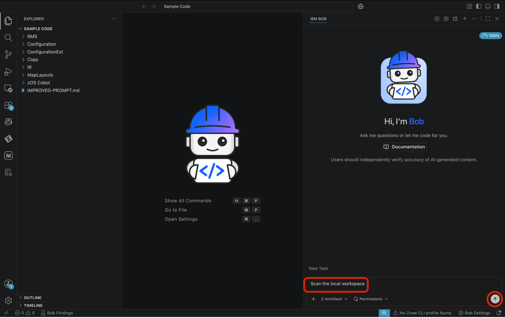

2. When Bob needs to take an action, a tool request card appears in the chat (example below):

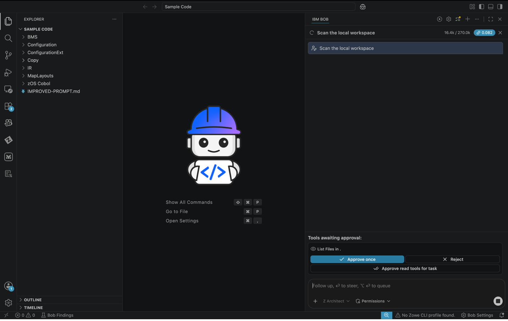

3. Additional approval requests may follow — click **Approve** for each or you may turn your auto approvals on in **Permissions**.

::: {.callout-warning}
## Do Not Close VS Code During the Scan
The scan must complete fully before Bob can run analysis queries against it.
:::

4. The scan typically takes 2–5 minutes depending on workspace size. When complete, Bob will confirm the scan finished and show a summary. You will note the location of your database in the `.bobz` folder under `local-settings.json`. The local database is now available for architecture analysis tasks.

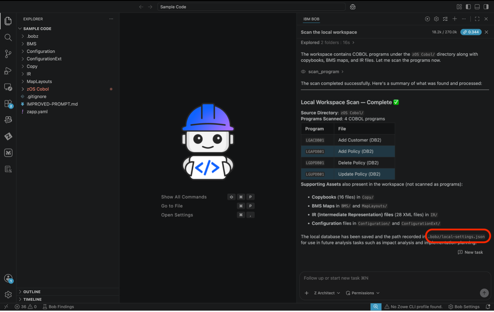

#### Expected Results

- ✅ Local metadata database created
- ✅ Program inventory populated
- ✅ Bob ready for application-level analysis

---

### Part 4: Initialize Agent.md

#### What This Does

Agent.md is Bob's persistent context document for your project. It creates a central reference for the agents, containing key artifacts such as file locations and user preferences, which guides the agents in analyzing COBOL programs by capturing details such as workspace type, repository structure, data dictionary location, and other relevant configuration information.

Bob reads Agent.md automatically at the start of every session — giving Bob project-aware responses from the first prompt.

#### Actions

1. Ensure you are in **Z Architect** mode. In the chat window, please paste/type the following prompt:

```
/init
```

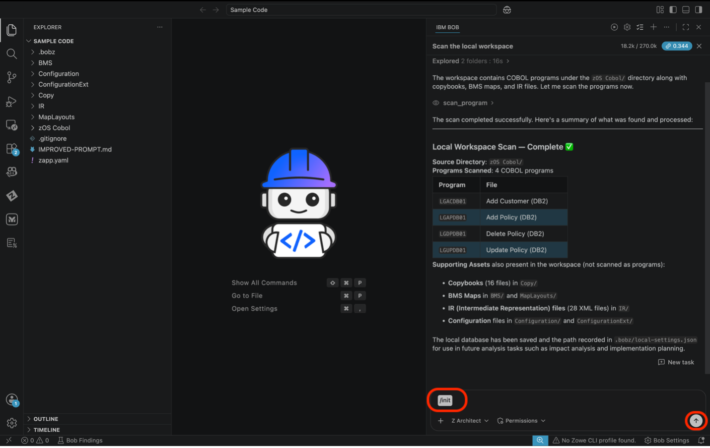

2. You will notice Bob starts by reading through your code base and reviewing the assets of the `.bobz` folder then he will begin to write the `AGENTS.md`. Click **Approve** for each step as prompted.

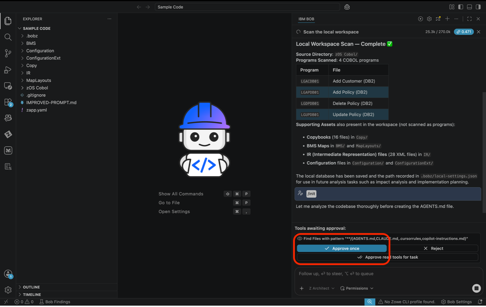

3. When complete, an `AGENTS.md` file will appear in the file explorer. Click **Preview** to review it.

::: {.callout-tip}
## Tip
If the AGENTS.md doesn't automatically open, locate it on the left explorer panel. You can preview by right clicking the file and selecting **Open Preview**, or you can select the file then in the top of your viewer select the icon that allows you to preview.
:::

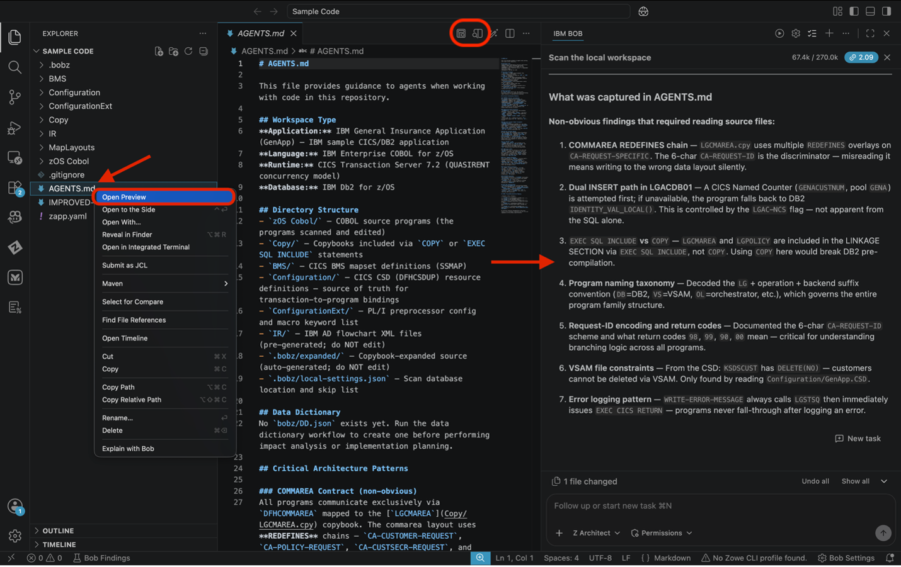

#### Expected Results

- ✅ `AGENTS.md` created at the workspace root
- ✅ Workspace type and structure documented
- ✅ Key directories (COBOL source, copybooks, BMS, JCL) captured
- ✅ Program naming conventions with call patterns
- ✅ Location of scan database documented

---

### Part 5: Generate a Data Dictionary

#### What This Does

The data dictionary maps COBOL variable names to their business-language meanings. COBOL field names like `CA-CUSTOMER-NUM` or `DB2-LASTNAME` are technical identifiers — the data dictionary gives them human-readable descriptions and business context.

Bob uses the data dictionary throughout your session to explain code in meaningful terms to your enterprise, identify relationships between fields, and reason about business logic rather than raw field names. It is stored as `bobz/DD.json` and referenced by Agent.md.

A workflow will be used for this task. Workflows guide you through complex tasks step by step with built-in AI prompts.

#### Actions

1. Select the **Workflows** icon.

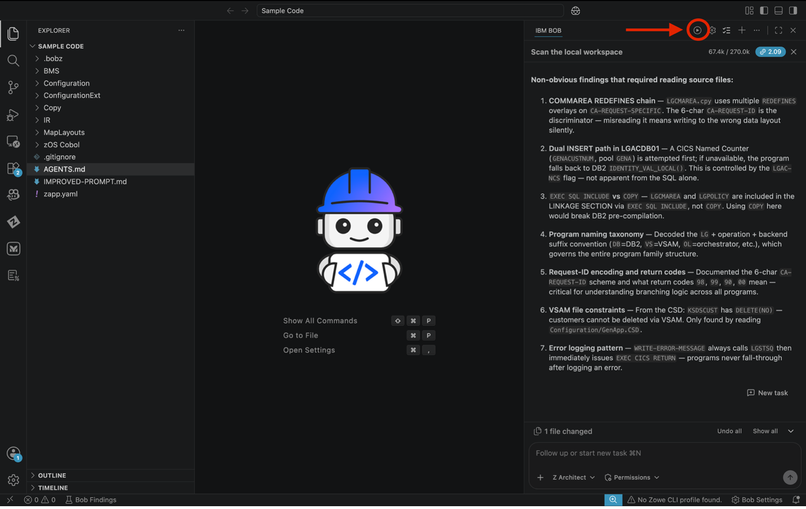

2. Select the workflow titled **Generate Data Dictionary**. You can use the dropdown to review what the workflow is used for.

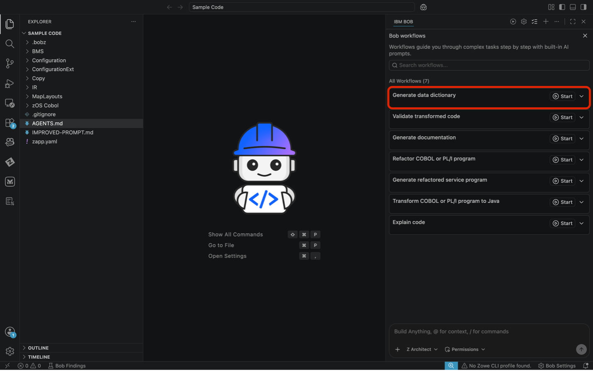

3. Bob will have you select a program. You can input a path or click **Browse Files** to select a code file. Then click **Continue with selection**.

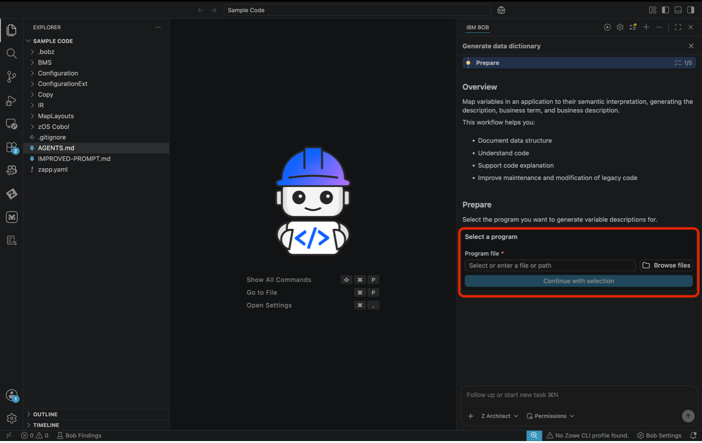

ACTION: Select **Browse files → zOS Cobol → LGACDB01.cbl → select file → Continue with selection**.

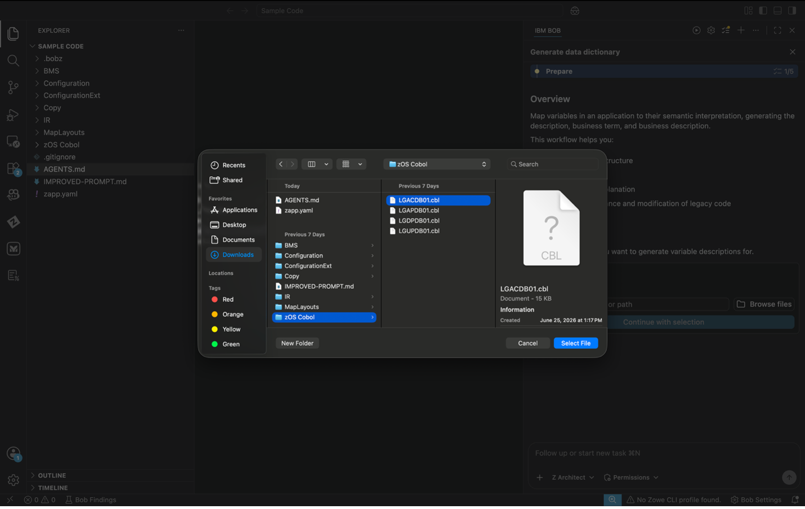

4. Bob may ask to use various skills to create the data dictionary. If auto approve is off, please select **Approve**. If prompted for various other approvals, please select approve each time unless noted.

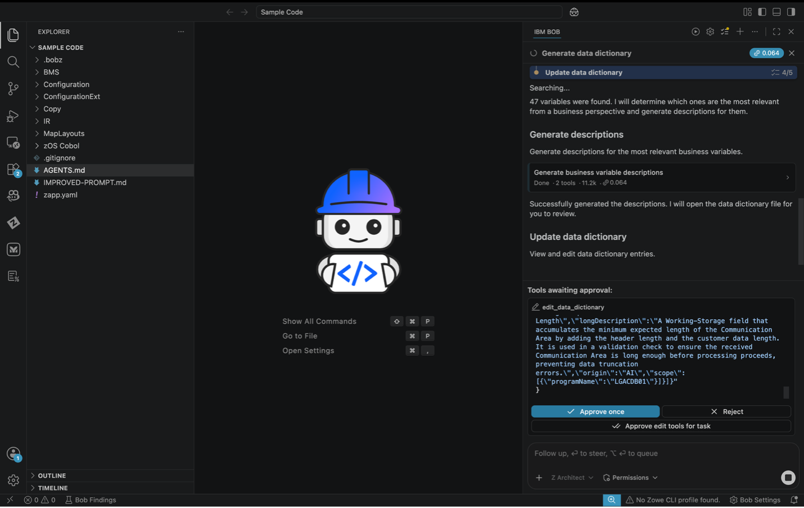

5. You will then be asked to review or edit entries:

- This is optional but valuable — you can correct interpretations, add business context, or clarify variable meanings at this point

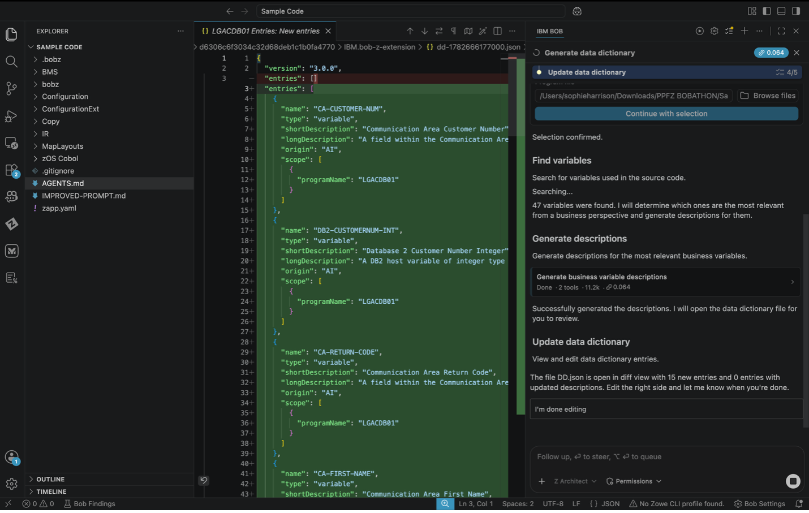

6. When complete, a `DD.json` file will appear in the file explorer under the `bobz` folder. Click to review it.

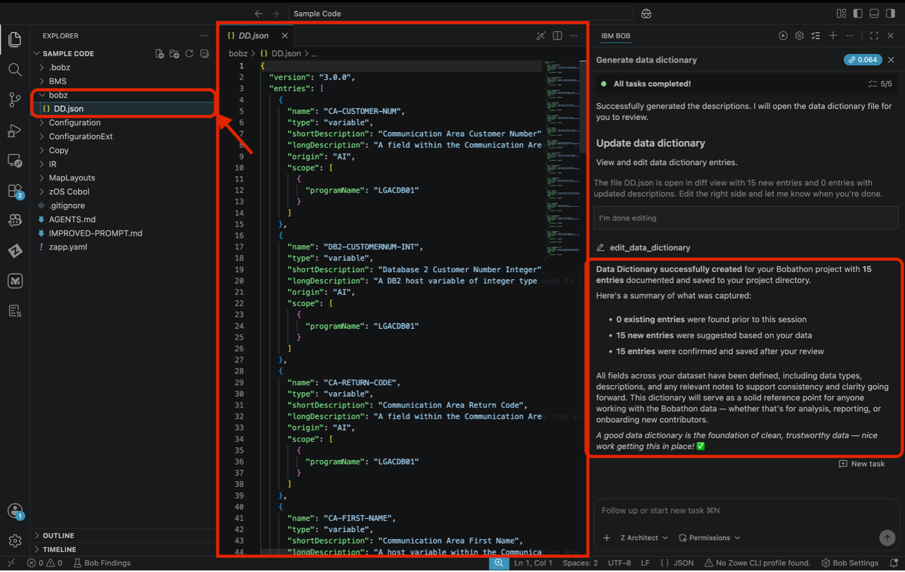

#### Expected Results

- ✅ `bobz/DD.json` created with variable descriptions
- ✅ Each entry includes a short description and detailed business context

---

### ✅ Lab 1 Setup Complete

Bob now has everything it needs to work deeply with your codebase:

| What Was Built | What It Does for Bob |
|---|---|
| **Metadata database** (from scan) | Answers questions about the whole application, not just open files |
| **Agent.md** | Provides project context at the start of every session |
| **Data Dictionary** | Translates field names into business language |

::: {.callout-tip}
## Start a New Chat
Please select the **+** sign at the top of the chat window to start a new session before moving to the next lab.
:::
