## Lab 5: Spec-Driven COBOL Development

> **Prerequisites:** Complete Lab 1 (Lab Setup) before starting this lab
> **Code Set:** Any COBOL workspace — recommended code: `Sample Code`
> **Spec Sheet:** `LGRENPOL-spec.md`
> **Duration:** 45 minutes
> **Difficulty:** Intermediate

### Overview

By the end of this lab, you will be able to:

- Use a program specification document to prompt COBOL code generation
- Instruct Bob to derive application coding standards from the existing codebase before generating
- Generate a new CICS COBOL program that integrates with existing copybooks and called programs
- Verify generated code against a specification's requirements
- Validate syntax using Z Open Editor
- Identify and correct any gaps between the spec and the generated output

#### Before You Begin

ACTION: Open `LGRENPOL-spec.md` in the editor using preview

Example of where it would be located: `/Users/<username>/Downloads/PPFZ BOBATHON/Sample Code/LGRENPOL-spec.md`

Note the key elements Bob will need to honor:

- Program ID: `LGRENPOL`, Transaction: `LREN`
- Uses the existing `LGCMAREA.cpy` and `LGPOLICY.cpy` copybooks
- Calls three existing programs: `LGIPDB01`, `LGUPDB01`, `LGSTSQ`
- 6-step processing flow with specific return codes
- Must follow GenApp naming and error-handling conventions

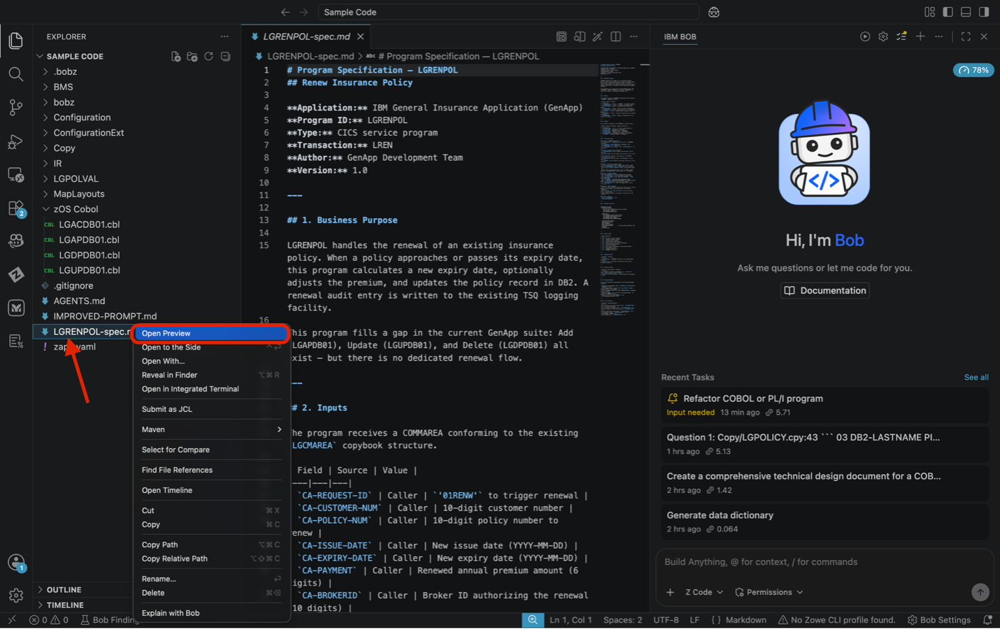

2. Review the document to understand the requirements and constraints.

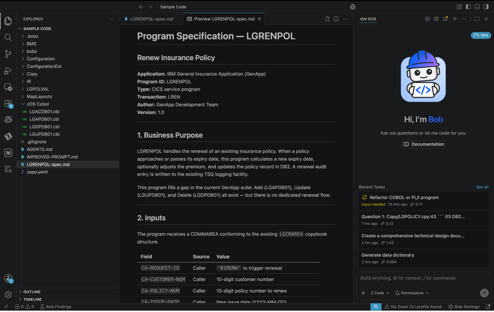

---

### Exercise: Coding Standards

#### Actions

ACTION: Ensure you are in **Z Architect** mode, and enter the following prompt In the chat:

   ```
   Analyze the existing COBOL programs in zOS Cobol/ and define the coding
   standards used across this application — focusing on naming conventions,
   COMMAREA patterns, CICS error handling, and program structure.
   ```

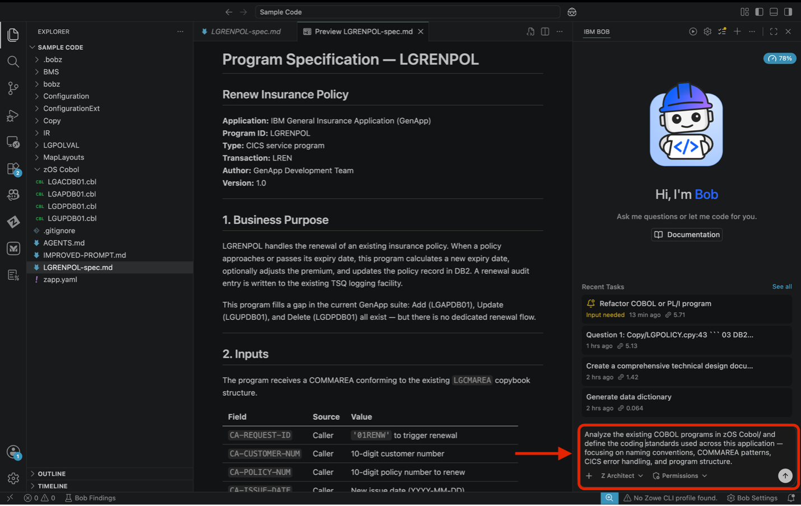

ACTION: Please select the **Approve** option when prompted or you can select **Approve All** in permissions to auto approve all requests.

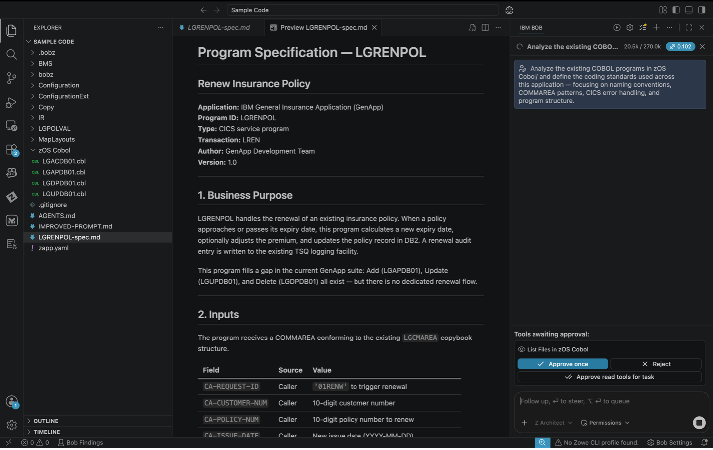

3. Please review the generated chat window on the right side of the screen.

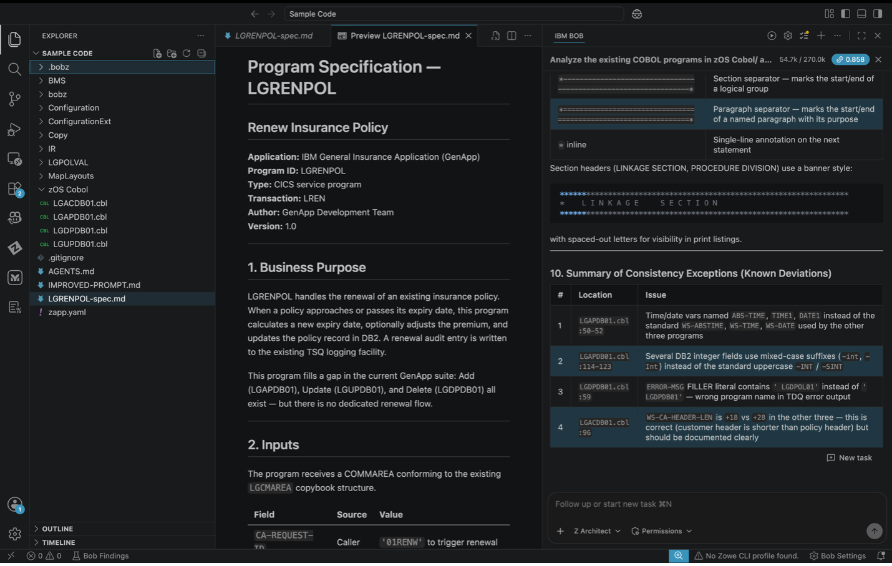

#### Expected Results

- ✅ Bob summarizes GenApp's coding conventions

### Exercise: Generate the Program from the Spec

Point Bob at the spec sheet and the existing codebase together — let it generate the full COBOL program in one prompt. The spec defines _what_ to build; the existing programs define _how_ to build it.

#### Actions

ACTION: Ensure you are now in Z Code mode, in the chat, enter:

   ```
   Using the program specification in LGRENPOL-spec.md, generate the complete
   CICS COBOL program LGRENPOL and save it as zOS Cobol/LGRENPOL.cbl.

   Follow the structure and conventions of zOS Cobol/LGAPDB01.cbl
   Key requirements:

   - Include LGPOLICY and SQLCA in WORKING-STORAGE, and LGCMAREA in the
     LINKAGE SECTION, all via EXEC SQL INCLUDE (not COPY)
   - Step 3 must use a direct EXEC SQL SELECT against the POLICY table —
     do NOT call LGIPDB01
   - Add RESP(WS-RESP) RESP2(WS-RESP2) on every EXEC CICS command
   - WS-HEADER eyecatcher must be 'LGRENPOL------WS'
   ```

> **Tip** When you paste it may show as "Pasted Text", if you click on it, it will appear like before. Press enter once completed.

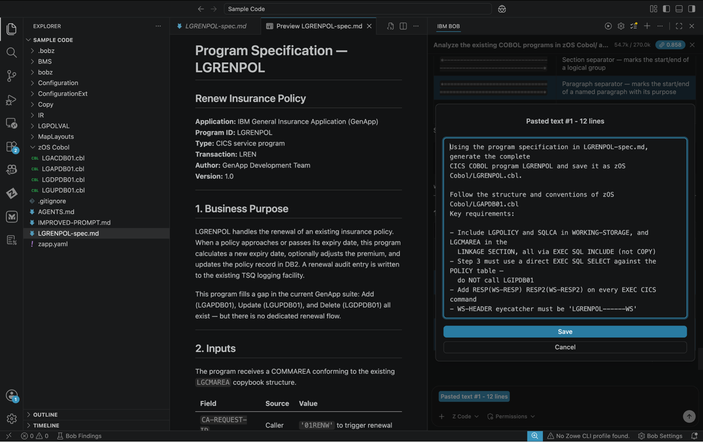

ACTION: You may see a couple of approvals, please continue to click approve unless otherwise noted. This will include the creation of the program.

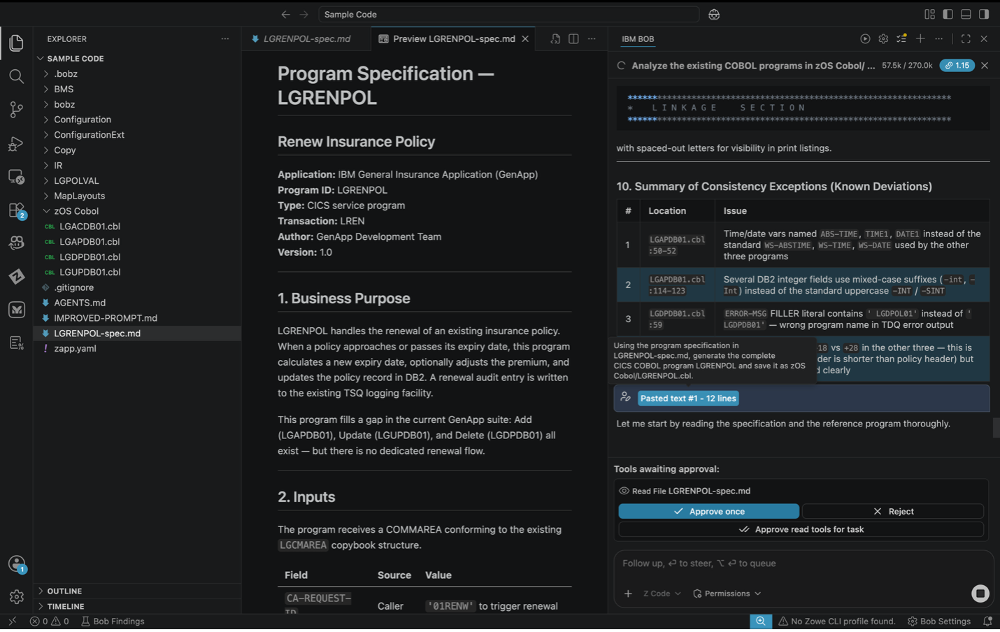

3. When complete, open `zOS Cobol/LGRENPOL.cbl` in the editor and review.

#### Expected Results

- ✅ `zOS Cobol/LGRENPOL.cbl` created
- ✅ `PROGRAM-ID. LGRENPOL` in the Identification Division
- ✅ `WS-HEADER` block present with eyecatcher `'LGRENPOL------WS'`
- ✅ `COPY LGCMAREA` in the Linkage Section
- ✅ `EXEC CICS LINK PROGRAM(LGUPDB01)` for the DB2 update
- ✅ All return codes from the spec (00, 01–05, 10, 11, 20, 97, 98) present
- ✅ All paragraphs end with `EXIT`

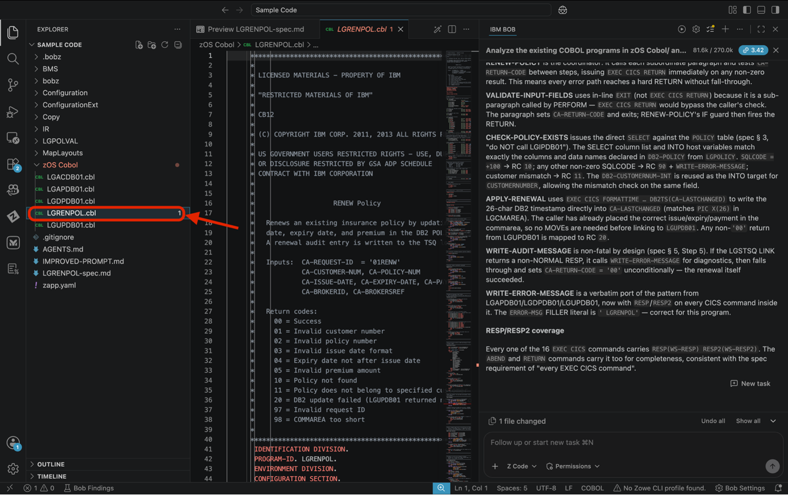

### Exercise: Verify Against the Spec

Systematically check the generated program against the spec — section by section. This is the review step a lead developer would perform before approving a generated program for testing.

#### Actions

ACTION: In the chat, enter the following prompt:

   ```
   Review the generated LGRENPOL.cbl against the requirements in labs/z-spec-driven-development/LGRENPOL-spec.md.
   Check each section of the spec and confirm whether the generated program
   fulfills it. List any gaps or deviations.
   ```

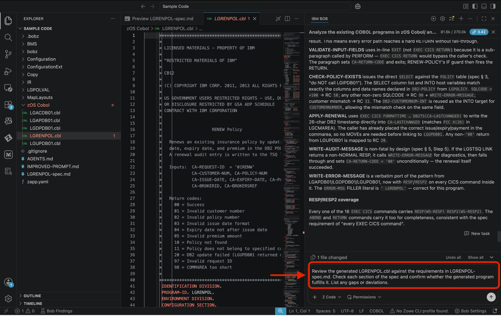

ACTION: Select the approve option unless otherwise noted.

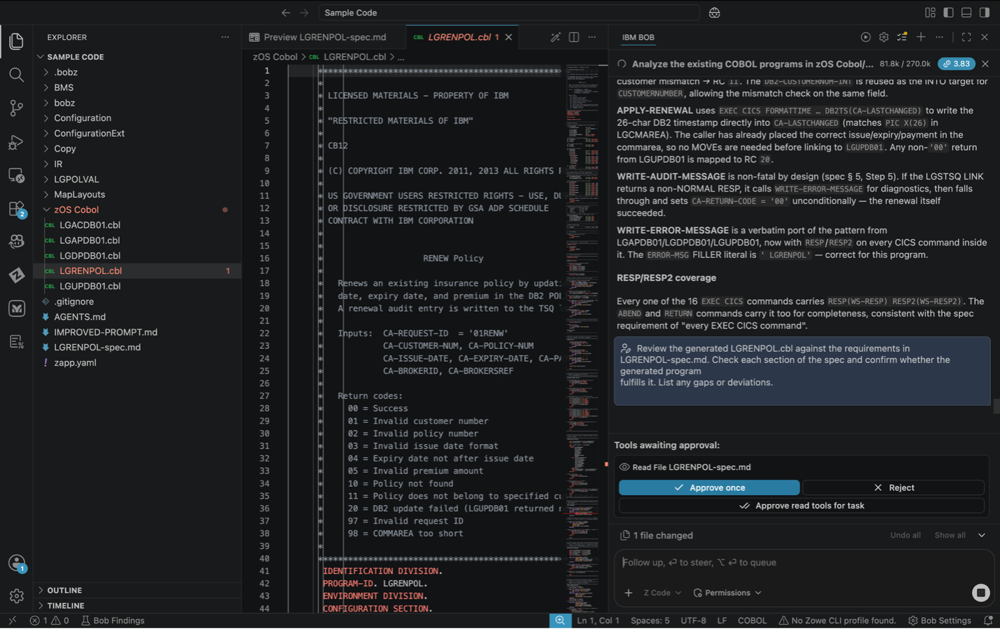

3. Review the generated chat window on the right side of the screen to understand any gaps or deviations from the spec.

> **Optional** Feel free to ask Bob to fix any gaps or deviations found in the review.

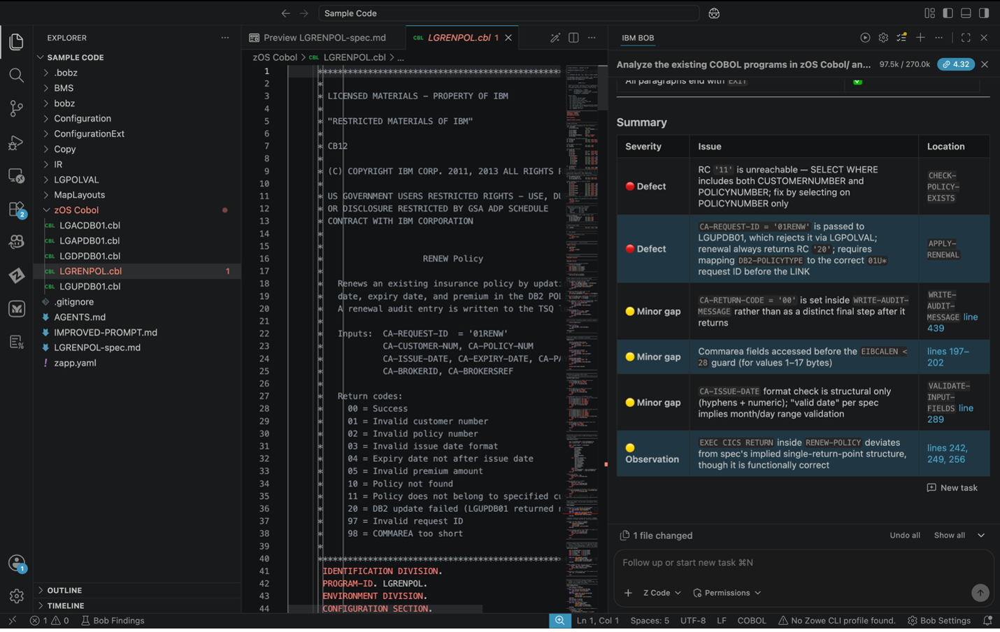

---

### Key Takeaways

- How to write a program spec that gives Bob enough context to generate correctly
- How to use a spec sheet as the primary generation prompt
- How to systematically verify generated code against a specification
